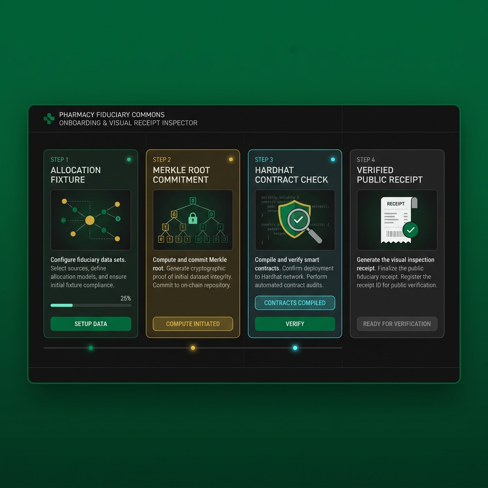

# Start Here: Pharmacy Fiduciary Commons

Pharmacy Fiduciary Commons is a local prototype to test one idea: independent pharmacies should be able to verify their rebate claims using math, rather than taking a PBM's word for it.

It is not audited, not deployed to mainnet, and not ready for real funds.

## The 10-Minute Path

One clean loop matters more than reading the whole repo first:

1. Run the demo command.
2. Open the dashboard it builds.
3. Look for the "First Run Receipt Flow" panel.
4. Use that panel to separate synthetic fixtures from contract-backed checks.

Prerequisites: Node.js 20 LTS or 22 LTS and npm.

On Windows PowerShell, prefer `npm.cmd` when script execution policy blocks `npm`.

1. Install reproducible dependencies:

```bash
npm.cmd ci
```

2. Run the local demo path:

```bash
npm.cmd run demo:local
```

This command compiles our smart contracts, builds dummy claim proofs, runs the test suite, and outputs the dashboard page at `dist/dashboard/index.html`.

3. Open the dashboard prototype:

```text
dist/dashboard/index.html
```


*Figure 1: The Ledger of Omissions dashboard displaying pass-through gap accounting, deposit provenance badges, and patient fund controls.*

Start with the "First Run Receipt Flow" near the top of the page. It shows the shortest story: synthetic allocations become Merkle proof material, focused contract tests exercise claim/export and patient-fund matching paths, and the dashboard bundle records the public prototype receipt. Values marked as synthetic fixtures are not live PBM claims, real patient records, or mainnet contract state.

## Five-Minute Guided Tour

Use this path when someone is seeing the repo for the first time. Stop after the
receipt flow; do not send them into the full dossier stack until this loop makes
sense.

1. Run `npm.cmd run demo:local`.
2. Open `dist/dashboard/index.html`.
3. Read the top provenance badge first: it should say local mock or synthetic.
4. Move to "First Run Receipt Flow".
5. Point at the four receipt steps in order: allocation, commitment, tested
   rules, public receipt.
6. Say what each step proves and what it does not prove.

The short explanation:

- Allocation: proves the demo can create a local synthetic allocation file.
- Commitment: proves the demo can generate Merkle proof material from that file.
- Tested rules: proves the contract test suite checked the relevant local flows.
- Public receipt: proves the built dashboard can show the result without
  pretending the fixture is real-world PBM data.

The visual tone should stay operational: obsidian dark base, jazz cyan only for
active or verified states, and warm amber for caution, scarcity, or unresolved
policy. If a color does not carry meaning, remove it.

## What You Should See

The demo writes these local artifacts:

- `cache/local-demo/allocations.json`: synthetic pharmacy allocations.
- `cache/local-demo/merkle.json`: generated root and per-pharmacy proofs.
- `dist/dashboard/index.html`: static dashboard build.

The command also prints the dashboard path at the end so a newcomer does not have to infer where the visual receipt lives.

The focused tests exercise two concrete flows:

- A pharmacy claim exported into a portability JSON payload and checked against Merkle proof material.
- Patient-fund matching distribution using squared vote weights.

## Plain-Language Tour

### For Independent Pharmacies

The prototype shows a rebate distribution pool where pharmacy claims are committed through a Merkle root. A pharmacy can prove it belongs in an allocation set without the dashboard inventing numbers after the fact.

What it does today:
- Local contract tests cover deposits, claims, daily caps, dispute flagging, recall timing, and accounting boundaries.
- **Dispute Tolling & Retraction Safeguard**: Flagged claims (`flagClaim()` / `flagExclusionDispute()`) lock disputed funds in reserve during an active resolution window. If the council does not resolve the dispute within `DISPUTE_TIMEOUT` (30 days), the pharmacy can invoke `retractDispute()` to safely reclaim its posture, preventing hostile PBMs or councils from silently burying claims.

What it does not do: guarantee drug supply, physical inventory, reimbursement law compliance, or production custody safety.

### For Patient Funds and Advocates

The prototype routes a share of gross claims into a patient fund and tests participatory allocation mechanics. The dashboard uses synthetic project cards to explain the flow without claiming that real patient programs have been funded.

What it does today: local tests cover round setup, voting mechanics, matching calculations, and pull-based project claims.

What it does not do: provide production privacy, medical advice, or a live claims administration system.

### For Auditors and Fiduciary Managers

The repo separates contract-backed checks from synthetic demo labels. Portability exports can be checked offline for schema, receipts, and Merkle math; RPC-backed verification is required before treating an export as chain-provenance-backed.

## Manual Commands

Run the full test suite:

```bash
npm.cmd test
```

Generate Merkle roots and proofs from your own allocation file:

```bash
npm.cmd run merkle:allocations -- --in allocations.json --out merkle.json
```

Run a portability export against a local or configured RPC endpoint:

```bash
node scripts/export-portability.js --exporter <participant_address> --from-block <deployment_block> --to-block <end_block_or_latest> --merkle merkle.json
```

Verify a portability export offline:

```bash
npm.cmd run verify:export -- --file exports/<participant_address>.json
```

Add `--rpc <url>` when you need chain-provenance verification instead of local self-consistency checks only.

## Documentation Path

Read in this order:

1. [README.md](README.md): status, architecture, quickstart, and safety boundaries.
2. [MECHANISM_COVERAGE.md](MECHANISM_COVERAGE.md): what is implemented, mocked, proposed, or blocked.
3. [PORTABILITY.md](PORTABILITY.md): export schema and verification expectations.
4. [GOVERNANCE.md](GOVERNANCE.md): council, timelock, confirmer, and guardian role boundaries.
5. [PRODUCTION_READINESS_CHECKLIST.md](PRODUCTION_READINESS_CHECKLIST.md): launch blockers.

Use the deeper review and threat-model documents after the first demo path is working.

## Demo Walkthrough Ideas

These are good short GIF or screen-recording targets:

- Run `npm.cmd run demo:local`, then open `dist/dashboard/index.html`.
- Start at the "First Run Receipt Flow" panel and point out which rows are synthetic fixtures versus contract-backed checks.
- Show the portability verifier warning that offline mode checks self-consistency only.
- Trace one patient-fund matching calculation from test setup to expected payout.

Suggested 30-second recording order:

1. Terminal command finishes and prints the dashboard path.
2. Dashboard opens on the provenance badge and first-run receipt panel.
3. Cursor pauses on each receipt step label.
4. Cursor lands on a synthetic badge, then on a contract-backed check badge.
5. End on the sentence: local prototype, synthetic fixtures, contract-backed
   checks.
