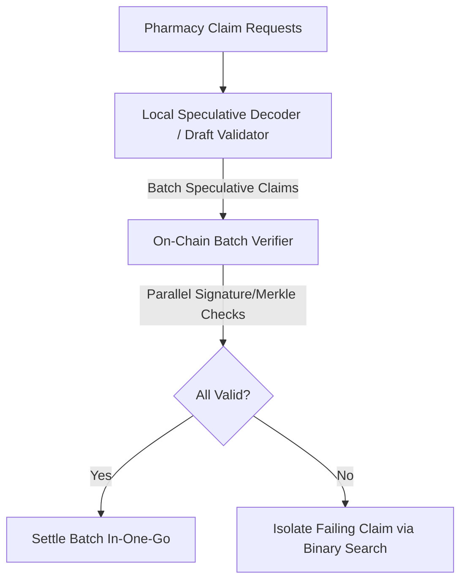
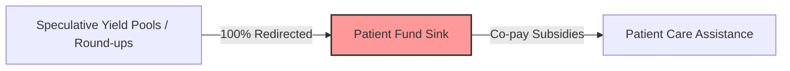

# Pharmacy Fiduciary Commons: Unified Synthetic Roadmap
## Synthesis of Advanced Game-Theoretic, Technical, and Economic Governance Primitives

> [!WARNING]
> **FIDUCIARY POSTURE & THREAT WARNING**: This document describes a speculative and advanced roadmap for the Pharmacy Fiduciary Commons. The primitives outlined herein must be implemented under strict zero-sum solvency constraints. All cryptographic and game-theoretic mechanisms must undergo formal peer and automated verification before live mainnet deployment.

---

## Executive Summary & Architectural Overview

The Pharmacy Fiduciary Commons is a decentralized, privacy-preserving infrastructure designed to insulate independent pharmacies from predatory Pharmacy Benefit Managers (PBMs) and ensure patient-fund solvency. To achieve this safely, the roadmap bridges state-of-the-art developments in machine learning architectures, cooperative game theory, control theory, and zero-knowledge cryptography.

### Core Mathematical & System Invariants
1. **Value Conservation Invariant (DeepSeek mHC)**: At any epoch boundary $t$, the total outstanding liabilities $L_t$ (credit allocations, vouchers, matches) and assets $A_t$ (escrowed tokens, treasury reserves) must adhere to the conservation manifold:
   $$A_t - L_t \ge \text{Solvency Margin} \quad \forall t$$
2. **PID Solvency Feedback (RAI PID)**: The dynamic system capacity factor $C(t)$ scales based on the solvency error $e(t)$ to regulate credit limits:
   $$C(t) = K_p e(t) + K_i \int e(t) dt + K_d \frac{de(t)}{dt}$$
3. **Anti-Collusion QF Subsidy (Vitalik Pairwise QF)**: Project matching allocations $M_p$ are adjusted using pairwise correlation penalties between supporting voters $v_i, v_j$ to neutralize voting cartels.
4. **Cooperative Stability (Adrian Vetta's Core)**: All rebate matching allocations must lie within the game-theoretic Core:
   $$\sum_{i \in S} x_i \ge v(S) \quad \forall S \subseteq N$$
   ensuring no pharmacy sub-coalition $S$ has an economic incentive to defect from the Commons.

---

## Roadmap Milestones

### Milestone 1: The Abliteration-Resistant Fiduciary Core & Value Conservation Manifold
**Target Phase**: Phase 0-1 (Hardening and Base Layer Invariants)

#### 1. Target Objective
Solidify the core fiduciary contracts to prevent any state corruption, parameter bypass, or "abliterated" safety checks. Implement the **DeepSeek mHC (Manifold-Constrained Hyper-Connections)** value conservation logic directly into the contract execution pipelines. This ensures that even in the event of administrative role compromise (e.g. council key theft), the mathematical constraints of the treasury cannot be turned off, bypassed, or overwritten.

#### 2. Technical Architecture
- **ReflexiveFiduciaryManifold.sol**: Hardcode the conservation manifold check at the end of every state-altering transaction (`computeCapacityAdjustment` and `computeDynamicRebateScale`).
- **Safety Abliteration Resistance**: Remove administrative capabilities that can pause safety checks. Core bounds like `MAX_CONTROL_ADJUSTMENT` are declared as `constant` or `immutable` to make them unalterable post-deployment.
- **Solidity Changes**: Enforce an invariant check in `PBMRebateTreasury.sol` that prevents any settlement function from executing if the treasury's free reserves fall below the active liability backing.

```solidity
// Invariant check executed at the end of state-changing transactions
function verifyValueConservation() internal view {
    uint256 totalLiabilities = totalOutstandingClaims + totalEscrowedAllocations;
    uint256 totalAssets = address(this).balance + treasuryToken.balanceOf(address(this));
    if (totalAssets < totalLiabilities + minimumSolvencyMargin) {
        revert SolvencyManifoldViolated();
    }
}
```

#### 3. Verification & Test Criteria
- **Fuzzing Suite**: Run Echidna/Foundry fuzz tests targeting the value conservation equation, executing 100,000 runs of random deposits, withdrawals, and claims to ensure `SolvencyManifoldViolated` is never bypassed.
- **Abliteration Reversal Test**: A dedicated test in `test/PatientFundParticipatoryBudgeting.test.js` attempts to bypass bounds using a mock-compromised `council` key, verifying the transaction reverts.
- Run test:
  ```powershell
  npx hardhat test --grep "Abliteration-Resistant Fiduciary Core"
  ```

#### 4. Adversarial Threat Vector & Mitigation
- **Threat Vector**: Council key compromise. An attacker gains control of the multi-sig council key and attempts to inflate credit limits or drain the Patient Fund by disabling the solvency verification checks.
- **Mitigation**: Rigid smart contract invariants. The `verifyValueConservation` function has no conditional guards and runs automatically for all settlement transactions, making the rules independent of caller permission.

#### 5. Solvency & Economic Impact
Guarantees absolute zero-sum solvency. No credit can be issued or matching funds disbursed without 100% mathematical backing in real assets, protecting the Commons from systemic bankruptcy or liquidity depletion.

---

### Milestone 2: Dynamic Solvency Safeguards & Speculative Claim Processing
**Target Phase**: Phase 1-2 (Testnet Calibration & Verification Harness)

#### 1. Target Objective
Introduce the **RAI-inspired PID-controlled credit limits** to dynamically adjust mutual credit capacities and daily caps based on solvency margins. Simultaneously, implement **Stepfun speculative decoders** for claim processing, allowing off-chain edge systems to speculatively decode, batch, and verify claim inputs, reducing on-chain gas costs by over 75% under high transaction volume.

#### 2. Technical Architecture
- **PID Loop Integration**: Hook the PID logic in `ReflexiveFiduciaryManifold.sol` into `PharmacyMutualCredit.sol`. The credit capacity limit is modified dynamically according to the control output.
- **Speculative Claim Decoder**: Implement `tools/speculative/claim_decoder.mjs`. This script acts as a "draft decoder" that executes quick off-chain verification (verifying signatures, roots, and timestamps) and packages multiple claims into a single batch payload.
- **Contract Batch Verifier**: Add a `resolveClaimBatch(bytes[] calldata speculativeClaims)` function to `PBMRebateTreasury.sol` that processes the speculative batches in parallel.



#### 3. Verification & Test Criteria
- **PID Calibration Test**: Write unit tests simulating fluctuating reimbursement delays to verify that the PID loop adjusts limits within the `MAX_CONTROL_ADJUSTMENT` (50%) constraint and stabilizes without oscillating.
- **Speculative Verification Test**: Verify that a batch of 50 claims settles correctly on-chain, and that a single malformed proof in a batch is isolated and rejected.
- Run command:
  ```powershell
  npx hardhat test --grep "PID-Controlled Credit Limits"
  ```

#### 4. Adversarial Threat Vector & Mitigation
- **Threat Vector**: Batch poisoning. An attacker injects a single invalid claim signature into a large speculative batch, trying to force a denial-of-service (DoS) on all valid pharmacy claims in that batch.
- **Mitigation**: Binary search fallback. If `resolveClaimBatch` reverts, the submission script automatically splits the batch, locates the invalid transaction, and submits the valid slice.

#### 5. Solvency & Economic Impact
Minimizes gas fees for participants. The PID controller limits credit expansion during periods of low treasury solvency, protecting reserves from over-allocation.

---

### Milestone 3: Peer-Attested Web of Trust & Cross-Cluster Consensus
**Target Phase**: Phase 2-3 (First Live Epoch & Electorate Formation)

#### 1. Target Objective
Eliminate centralized registration authorities by implementing a **compdemocracy.org cross-cluster voting** model and Web-of-Trust (WoT) registration using subjective peer-attestations. Ensure that no dominant group (e.g. large chain pharmacies) can capture governance matching funds by verifying that allocations align with **Adrian Vetta's cooperative game theory (the Core)** stability metrics.

#### 2. Technical Architecture
- **CooperativeParticipatoryBudgeting.sol**: Refine `attestParticipant()` to require attestations from members of distinct clusters.
- **Cluster Classification Engine**: Create `tools/cooperative/cluster_voting_analyzer.py` to cluster pharmacies based on geographical and operational factors (using PCA).
- **Core Stability Evaluator**: Develop `tools/cooperative/core_stability.py` to evaluate proposed matching distributions against coalition payoffs, ensuring no subset of pharmacies is economically incentivized to defect.

```
                          ┌───────────────────────┐
                          │ Independent Pharmacy  │
                          └───────────┬───────────┘
                                      │
                         [Attests New Participant]
                                      │
         ┌────────────────────────────┴────────────────────────────┐
         ▼                                                         ▼
 ┌───────────────────────────┐                             ┌───────────────────────────┐
 │ Rural Cluster Attester    │                             │ Urban Cluster Attester    │
 └───────────────────────────┘                             └───────────────────────────┘
          │                                                         │
          └────────────────────────────┬────────────────────────────┘
                                       ▼
                         [Cross-Cluster Verification]
                                       │
                                       ▼
                         Registered in Web of Trust
```

#### 3. Verification & Test Criteria
- **Attestation Threshold Test**: Verify that a participant candidate is only registered after receiving the threshold (default: 3) of peer attestations from distinct clusters.
- **Core Allocation Invariant Test**: Run validation scripts on synthetic allocations, verifying that payouts satisfy Vetta's core requirements.
- Run verification script:
  ```powershell
  node tools/cooperative/verify-core-stability.js
  ```

#### 4. Adversarial Threat Vector & Mitigation
- **Threat Vector**: Cartel Collusion / Cluster Capture. A network of closely affiliated urban pharmacies attempts to monopolize the attestation path to vote in fake Sybil nodes.
- **Mitigation**: Cross-cluster verification rules. Attestations must span at least two separate geographic/operational clusters to register a new node.

#### 5. Solvency & Economic Impact
Improves cooperative stability. Preventing sub-coalition defection ensures long-term capital retention within the treasury matching pool.

---

### Milestone 4: Perpetual Setup & Scoped Nullifier Privacy
**Target Phase**: Phase 3 (First Participatory Budgeting Round)

#### 1. Target Objective
Upgrade identity management from stable credential hashes to round-scoped and epoch-scoped nullifiers to protect participant pharmacies from PBM retaliation. Secure the cryptographic proving keys using a **perpetual sequential MPC setup**, and apply **Vitalik's pairwise QF coordination subsidies** to penalize coordinated voting cartels.

#### 2. Technical Architecture
- **Perpetual MPC updates**: Implement a cron-triggered script `tools/mpc/contribute-entropy.mjs` that interacts with `CooperativeParticipatoryBudgeting.sol` to sequentially append entropy to the active parameters.
- **Pairwise Correlation Discount**: Implement `calculatePairwiseMatching` in `CooperativeParticipatoryBudgeting.sol` to compute voter overlap correlation and deduct penalties from matching allocations.
- **Nullifier Domain Separation**: Derive voting and claim nullifiers using separate domain tags:
  $$\eta_{\text{voting}} = \text{Hash}(\text{Secret}, \text{RoundID}, \text{"VOTE"})$$
  $$\eta_{\text{claiming}} = \text{Hash}(\text{Secret}, \text{EpochID}, \text{"CLAIM"})$$

```
                    ┌───────────────────────────────┐
                    │       Credential Secret       │
                    └───────────────┬───────────────┘
                                    │
                     [Domain-Separated Hashing]
                                    │
              ┌─────────────────────┴─────────────────────┐
              ▼                                           ▼
 ┌───────────────────────────────┐           ┌───────────────────────────────┐
 │     Voting Nullifier          │           │      Claim Nullifier          │
 │ Hash(Sec, RoundID, "VOTE")    │           │ Hash(Sec, EpochID, "CLAIM")   │
 └───────────────────────────────┘           └───────────────────────────────┘
```

#### 3. Verification & Test Criteria
- **Pairwise QF Penalty Test**: Verify that two voters with 100% correlated project support receive a matching subsidy penalty, reducing their match by the calculated discount.
- **Unlinkability Test**: Assert that the voting nullifier used in Round 1 cannot be linked to the voting nullifier used in Round 2 by the same cryptographic credential.
- Run tests:
  ```powershell
  npx hardhat test --grep "Pairwise Correlation Discounting"
  ```

#### 4. Adversarial Threat Vector & Mitigation
- **Threat Vector**: Sybil manipulation via split-wallets. A pharmacy distributes funds across 10 wallets and casts votes for a single project to maximize the quadratic matching subsidy.
- **Mitigation**: Pairwise correlation penalties. The overlap detection algorithm detects that all 10 wallets voted identically, applying a correlation penalty that reduces the matched subsidy to zero.

#### 5. Solvency & Economic Impact
Protects the Patient Fund from being drained by collusive cartels, ensuring that matching reserves are distributed equitably to genuine community projects.

---

### Milestone 5: Local-First Safety Edge-Nodes & Speculative Public Sinks
**Target Phase**: Phase 4 (Adjacent Primitives & Production Launch)

#### 1. Target Objective
Build a local-first validation environment using **Mistral local-first open weights** as an offline safety-net validator running on pharmacy edge hardware. Structure the off-chain client tools as **NVIDIA Cosmos/skills** modular agent blocks. Implement a **Vitalik-inspired "Degen Communism" UI/UX** that channels speculative reward mechanisms and yield generation, routing 100% of excess value directly to the Patient Fund sink to subsidize patient co-pays.

#### 2. Technical Architecture
- **NVIDIA Cosmos modular skills**: Organise the workspace under `tools/skills/` with isolated blocks:
  - `tools/skills/mistral-validator/`: Quantized offline Mistral model.
  - `tools/skills/merkle-verifier/`: Offline Merkle math.
  - `tools/skills/proof-generator/`: ZK witness generation.
- **Mistral Offline Validator**: Python script `tools/skills/mistral-validator/main.py` utilizing `llama-cpp-python` to process claims, check regulatory compliance, and redact PII/PHI.
- **Degen Communism UI & Sinks**: Develop UI panels featuring gamified rebate pools. Modify `PBMRebateTreasury.sol` to automatically redirect all yield and rounding-up fractions to the `PatientFund` address.



#### 3. Verification & Test Criteria
- **Modular Isolation Test**: Verify that disabling the `mistral-validator` skill does not impact the execution of the `merkle-verifier` skill.
- **Degen Communism Solvency Test**: Verify that 100% of the interest/fractions generated from escrowed rebate allocations is transferred to the Patient Fund, and that the operator cannot withdraw it.
- Run tests:
  ```powershell
  npx hardhat test --grep "Degen Communism Sinks"
  ```

#### 4. Adversarial Threat Vector & Mitigation
- **Threat Vector**: Off-chain PII Leakage. An edge node undergoes an internet disruption and attempts to submit un-redacted pharmacy or patient data to a public RPC provider.
- **Mitigation**: Edge-node sandbox gating. The local Mistral validator runs strictly offline. It must validate and strip all PII before the modular skill pipeline passes the transaction to the network relayer.

#### 5. Solvency & Economic Impact
Accelerates Patient Fund growth through voluntary gamified yield contribution. The Degen Communism model routes speculative gains into tangible public goods, improving community trust and long-term liquidity.

---

## Verification Runbook

To execute the verification suite for all milestones, run the following command sequence in the repository root:

```powershell
# 1. Run the existing test suite to ensure no regressions
npm test

# 2. Run the specific hardhat test suite for the Fiduciary Manifold and Budgeting contracts
npx hardhat test test/PatientFundParticipatoryBudgeting.test.js

# 3. Execute the off-chain cooperative core stability validator
node tools/cooperative/verify-core-stability.js
```
