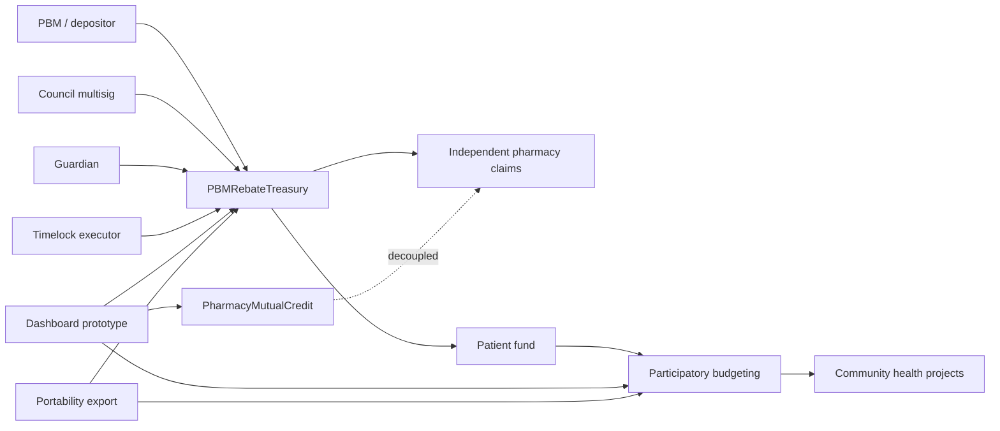

# Pharmacy Fiduciary Commons

<div align="center">

**On-chain rebate transparency infrastructure for independent pharmacies and patient funds.**


</div>

> [!CAUTION]
> **NOT AUDITED - DO NOT USE REAL FUNDS YET**
>
> This repository is a working local/testnet prototype. Do not deploy, deposit, or route real capital to this treasury on mainnet until an independent security audit has been completed and published.

---

## What Runs Today

| Surface | Status |
|---------|--------|
| `PBMRebateTreasury` | Working Solidity contract with epoch escrow, Merkle claims, dispute handling, sanctions, recall, pause, and cap controls |
| `PatientFundParticipatoryBudgeting` | Working patient-fund voting prototype with council registration and relayer-assisted voter self-registration |
| `PharmacyMutualCredit` | Working decoupled mutual-credit and voucher prototype with issuer credit-limit enforcement |
| Tests | `40 passing` via `npm.cmd test` |
| Dashboard | Static prototype with local/test Web3 integration guardrails |
| Merkle tooling | Allocation root/proof generator |
| Portability export | Prototype JSON export plus local verifier for claims, proofs, votes, and receipts |
| Mainnet | Not deployed |
| External audit | Pending |

---

## Quickstart

Prereqs: Node.js + npm.

Windows PowerShell note: if `npm` is blocked by script execution policy, use `npm.cmd` instead.

```bash
npm.cmd ci
npm.cmd run compile
npm.cmd test
```

Generate Merkle roots and proofs:

```bash
npm.cmd run merkle:allocations -- --in allocations.json --out merkle.json
```

Run the portability export prototype:

```bash
node scripts/export-portability.js --exporter <participant_address>
```

Verify a portability export:

```bash
npm.cmd run verify:export -- --file exports/<participant_address>.json
```

---

## Architecture



---

## What This Is

`PBMRebateTreasury` is an Ethereum smart contract that:

- records rebate deposits on-chain with depositor identity, amount, quarter, drug class, and source;
- routes captured funds to independent pharmacies through Merkle-proof claims;
- allocates 10% of every gross claim to a dedicated patient fund at claim time;
- makes missing deposits visible through a Ledger of Omissions;
- separates treasury custody from adjacent prototypes such as mutual credit, vouchers, dashboard tooling, and participatory budgeting.

This is infrastructure for transparent rebate pass-through. It is not legal, financial, medical, or investment advice.

---

## Core Lifecycle

1. PBM or depositor calls `depositRebate()`.
2. Council member calls `proposeRoot()` for the current epoch.
3. A second distinct council member calls `confirmRoot()`.
4. Pharmacies claim with Merkle proofs through `claim()` or `claimBatch()`.
5. Council calls `finalizeEpoch()` to close the epoch.
6. After the 30-day `RECALL_DELAY`, unclaimed funds can be recalled to `patientFund`.

---

## Treasury Buckets

| Bucket | Allocation | Purpose |
|--------|------------|---------|
| Distribution pool | 99% | Pharmacy Merkle claims |
| Governance reserve | 1% | Council operations through `EXECUTOR_ROLE` |

## Patient Fund

| Source | Amount |
|--------|--------|
| Every gross claim | 10% routed to `patientFund` |
| Unclaimed epoch funds after recall delay | 100% routed to `patientFund` |
| Non-payout token sweeps | 100% routed to `patientFund` |

## Roles

| Role | Holder | Permissions |
|------|--------|-------------|
| `COUNCIL_ROLE` | 3/5 Gnosis Safe | Epoch management, root co-sign, recall, sanctions, unpause |
| `EXECUTOR_ROLE` | TimelockController | Cap changes, governance reserve withdrawal, environment fund update |
| `GUARDIAN_ROLE` | Separate fast-response address | Emergency pause only; cannot unpause or access funds |

---

## Security Properties

- Hard cap enforced at root proposal and claim.
- Daily cap enforced at root proposal and claim.
- Root total enforced at claim.
- Per-pharmacy cap enforced through Merkle leaf encoding.
- Double-hash leaf construction for second-preimage protection.
- Root publication requires two distinct `COUNCIL_ROLE` members.
- Daily cap remains bounded by hard cap.
- Recall only after `RECALL_DELAY`, only for unclaimed amount, sent to `patientFund`.
- Payout token cannot be swept.
- Non-payout tokens are swept to `patientFund`, not a general fund.
- `GUARDIAN_ROLE` is separate from `COUNCIL_ROLE`.
- `flagClaim` requires a valid Merkle proof.
- Disputed active-epoch claims update cap and recall accounting consistently.
- Sanctioned addresses cannot flag claims.
- Open dispute flag blocks a parallel claim on the same epoch.
- ETH is rejected through `receive()` and `fallback()`.
- No upgradeability.

---

## Merkle Leaf Encoding

```solidity
// Double-hash leaf. abi.encodePacked is safe here because all fields are fixed-size.
bytes32 leaf = keccak256(
    bytes.concat(keccak256(abi.encodePacked(pharmacy, grossAmount, eligibleCap)))
);
```

Each leaf encodes:

- `pharmacy`: claimant address
- `grossAmount`: gross allocation for this epoch
- `eligibleCap`: per-pharmacy maximum enforced on-chain

> Off-chain tooling must use `encodePacked`, not `encode`, when hashing leaves.

---

## Deployment Parameters

```solidity
constructor(
    address _token,
    address _patientFund,
    address _environmentalFund,
    uint256 _initialDailyCap,
    address _council,
    address _executor,
    address _guardian
)
```

Before mainnet deployment:

- complete a formal security audit;
- configure a 3/5 Gnosis Safe for `_council`;
- deploy and configure a `TimelockController` for `_executor`;
- confirm `_guardian` is separate from council;
- verify every address on the target network.

---

## Deployment Script

This repo includes a convenience Hardhat script:

```text
scripts/deploy-timelock-and-treasury.js
```

Required environment variables:

- `TOKEN`
- `PATIENT_FUND`
- `ENVIRONMENTAL_FUND`
- `INITIAL_DAILY_CAP`
- `COUNCIL`
- `GUARDIAN`

Optional timelock variables:

- `TIMELOCK_MIN_DELAY_SECONDS`
- `TIMELOCK_PROPOSERS`
- `TIMELOCK_EXECUTORS`
- `TIMELOCK_ADMIN`

---

## Audit And Production Status

| Item | Status |
|------|--------|
| Internal review | Complete enough for prototype iteration |
| External audit | Pending |
| Mainnet deployment | Not deployed |
| Production frontend build | Pending |
| Database/API/RLS surface | Not present yet |
| Production readiness checklist | See `PRODUCTION_READINESS_CHECKLIST.md` |
| Mechanism coverage | See `MECHANISM_COVERAGE.md` |
| Security reporting | See `SECURITY.md` |

---

## Adjacent Designs

To preserve treasury simplicity, these systems are intentionally decoupled:

- `PatientFundParticipatoryBudgeting`: patient-fund project allocation prototype.
- `PharmacyMutualCredit`: mutual-credit and emergency voucher prototype.
- `tools/credentials`: credential issuance and verification prototype.
- `scripts/export-portability.js`: portability export prototype.
- `dashboard/`: static dashboard and local/test Web3 prototype.

---

## Background

The project is motivated by rebate pass-through gaps affecting independent pharmacies and patient access. Policy references in this repository are context for the model, not legal conclusions. Any procurement clause, ERISA-facing language, deployment plan, or real-funds workflow requires qualified legal review.

---

## Contributing

Contributions are welcome, especially:

- test suite expansion;
- dashboard hardening and accessibility;
- Merkle and portability tooling;
- documentation cleanup;
- security review.

Open an issue before submitting a large PR.

---

## License

MIT. See [LICENSE](./LICENSE).

---

## Mission

Independent pharmacies serve communities that large chains abandon. They dispense prescriptions on thin margins, absorb clawbacks they cannot audit, and often lack a durable ledger to point to when the numbers do not add up.

This repository explores that ledger.

Every deposit is permanent. Every omission is visible. The machine comes first; the mission can stand on it.
