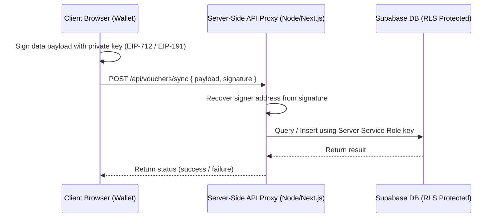

# Option 1: Database Security Containment and Architecture Plan

Status: **Draft Proposal for Review**. Do not implement changes to the codebase until this plan is accepted and explicit implementation authorization is granted.

---

## 1. The Vulnerability & Leakage Risk

The current modifications in the local working tree (`dashboard/web3_integration.js` and `tools/offline/continuity-kit.html`) introduce critical security issues:
1.  **Exposed Database Credentials:** The Supabase URL and Anon Key are input directly in the client UI and cached in browser `localStorage`.
2.  **Shared Auth Account:** Both the dashboard and the offline kit authenticate using a single hardcoded operator account (`operator@fiduciary.commons` / `password123`) in the browser script.
3.  **RLS Bypass:** Because all participants share the same `auth.uid()`, Row-Level Security (RLS) is rendered useless. Any connected client can view, modify, or delete the voter profiles, proposals, and offline vouchers of all other participants.

---

## 2. Containment Plan: Immediate Cleanups

Before implementing a full server-side solution, we will contain client-side exposure by modifying `dashboard/web3_integration.js` and `tools/offline/continuity-kit.html` to:
*   **Remove Hardcoded Credentials:** Strip the `demoEmail` and `demoPassword` variables completely from client-side scripts.
*   **Remove LocalStorage Key/URL Cache:** Remove `localStorage.setItem` for `SUPABASE_URL`, `SUPABASE_ANON_KEY`, `supabase_url`, and `supabase_key`.
*   **Hide DB Config Panel:** Deprecate the UI input panels for entering database credentials in the browser interface, preventing operators from entering database service keys or exposing backend configuration.

---

## 3. Proposed Architectures for Production Sync

We propose two secure options to replace the shared client-side login model:

### Architecture A: Server-Side API Proxy (Recommended)

To completely shield the database from direct client queries, all Supabase operations are moved behind a lightweight, zero-dependency server-side API gateway.



1.  **No Client-Side DB Access:** The client browser never communicates directly with Supabase. It only speaks to the app's serverless endpoints (e.g. `/api/voter_profiles/sync` and `/api/offline_vouchers/upload`).
2.  **Web3 Signature Authentication:** The client signs the payload (e.g. the voter profile or offline voucher data) using EIP-712 or EIP-191 signatures. 
3.  **Proxy Recovery & Validation:** The API proxy recovers the signer's wallet address from the signature. It validates that the signer matches the target profile/voucher owner.
4.  **Secure Serverless Credentials:** The API proxy performs the database query/update using Supabase service-role keys stored securely in server environment variables (never disclosed to the browser).

### Architecture B: Web3 Wallet Auth via Custom JWT (Decentralized RLS)

If direct client-to-database communication is required (e.g., to reduce server costs or leverage Supabase Realtime), we can generate user-specific Supabase JWTs on-chain/via Web3-auth.

1.  **Web3 Login Flow:** When a wallet connects, the client signs a sign-in challenge.
2.  **Custom Token Generation:** An auth endpoint verifies the signature and mints a custom Supabase JWT containing the user's recovered wallet address as a custom claim:
    `{ "sub": "user-uuid", "wallet_address": "0x..." }`
3.  **Granular RLS Enforcement:** In `supabase/schema.sql`, we update the RLS policies to check the wallet claim in the JWT instead of `auth.uid() = id`:
    ```sql
    CREATE POLICY "Users can insert their own profile" ON public.voter_profiles
        FOR INSERT WITH CHECK (
            (auth.jwt() ->> 'wallet_address') = wallet_address
        );
    ```
4.  **Impact:** Every user operates under their own authenticated session, enabling Row-Level Security to isolate user records natively at the database level.

---

## 4. Next Step & Verification Plan

1.  **Step 1 (Cleanup):** Wipe exposed credentials and browser persistence from `dashboard/web3_integration.js` and `tools/offline/continuity-kit.html`.
2.  **Step 2 (Local Verification):** Verify that the dashboard compiles and runs in local mock mode without Supabase connection elements.
3.  **Step 3 (Proxy Setup):** Design and present the serverless API proxy files (e.g., in a new `server/` directory) for your approval before writing them.
