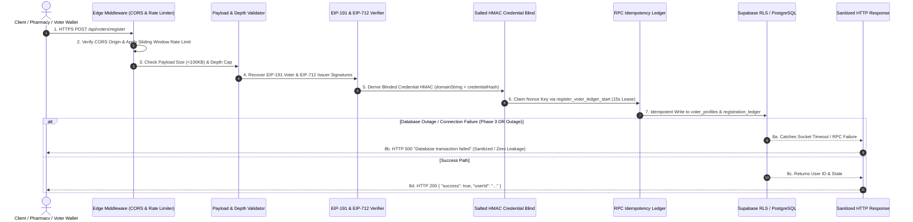

# Database API Proxy Request Lifecycle & Compact Authorization Matrix

> **Status**: PROOF-BOUNDED DESIGN SPECIFICATION
> **Target Subsystem**: `server/createApp.js`, `test/server.test.js`, and `contracts/`
> **Evidence Lineage**: `[dirty working tree]`

---

## 1. Voter-Registration HTTP Request Lifecycle

The voter-registration API path (`POST /api/voters/register`) follows an 8-stage fail-closed pipeline:

---

## 2. Pipeline Stage Breakdown

### Stage 1: Edge Security & CORS Middleware
- **CORS Defense-in-Depth**: `originCheck` checks Origin headers and rejects `null` origins with `403 CORS policy violation: null origin not permitted`.
- **Sliding Window Rate Limiter**: Limits per-IP / per-wallet submission frequency; returns `429 Too many requests`.

### Stage 2: Payload & Depth Validation
- **Body Limit**: Enforces `express.json({ limit: "100kb" })` to prevent memory exhaustion DoS attacks.
- **Recursion Depth Cap**: Evaluates object nesting depth. Deeply nested payloads are rejected before stringification to protect against stack-overflow attacks.

### Stage 3: Cryptographic Signature & Domain Verification
- **Voter Signature (EIP-191)**: Verifies personal message signature over canonical payload string. Asserts `proxyAddress`, `chainId`, `roundId`, and `voter` wallet match server config.
- **Relayer Signature (EIP-712)**: Verifies structured typed data signature against `trustedCredentialIssuer` address.

### Stage 4: Credential Blinding & Privacy Boundary
- Derives `blindedCredential` using salted HMAC:
  $$\text{blindedCredential} = \text{HMAC-SHA256}(\text{credentialPepper}, \text{domainString} \parallel \text{credentialHash})$$
- Raw credentials and unblinded patient identities are **never** written to database disk.

### Stage 5: Idempotency Lease Claim
- Calls RPC `register_voter_ledger_start(nonceKey, requestHash)`.
- Enforces a 15-second active lease window to block concurrent replay submissions.

### Stage 6: Database Persistence & Sanitized Fail-Closed Response
- On database outage or lock timeout, catches exceptions and returns generic `500 Database transaction failed`.
- Internal stack tracebacks, Supabase connection strings, and credential secrets are strictly redacted.

---

## 3. Compact System Authorization Matrix

| Actor / Role | Authentication Standard | Permitted Actions | Security Boundaries & Constraints |
| :--- | :--- | :--- | :--- |
| **Voter / Pharmacy** | EIP-191 Personal Signature | Submit registration, relay nullifiers, submit voucher sagas | Cannot modify rounds, pause contracts, or access other pharmacy claims. |
| **Trusted Issuer** | EIP-712 Typed Data Signature | Authorize voter self-registration credential hashes | Key rotation enforced via `setRelayerVerifier`. Cannot execute payouts. |
| **Relayer Daemon** | EIP-712 Domain Authorization | Submit batch relay intakes on behalf of voters | Cannot alter nullifier proof payloads or modify contract state directly. |
| **Guardian** | EOA / Multisig | Execute emergency `pause()` | **Cannot** call `unpause()`, withdraw funds, or alter dispute allocations. |
| **Council** | Multisig | Call `unpause()`, resolve disputes, sweep non-pool assets | Bound by daily/epoch volume caps. Cannot override paused state. |
| **Executor / Timelock** | On-Chain Governance | Rotate parameters, modify daily caps, recover forced ETH | Governed by timelock execution delay. |
| **Service Role (DB)** | Supabase Service JWT | Audit global multi-tenant ledgers & aggregate metrics | Bypasses RLS for audit logging; never exposed to public web clients. |
