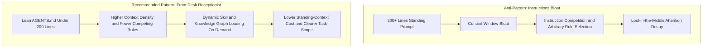

# System Prompt Pruning, Instruction Governance, and Lost-in-the-Middle Guardrail

> **Status**: DESIGN SPECIFICATION / PROMPT HYGIENE AUDIT
> **Domain**: Agent scaffolding, `AGENTS.md` maintenance, and skill audit standards
> **Reference**: Operator-provided prompt-pruning article and local repository audit. External Anthropic guidance is not independently verified in this document.
> **Evidence Lineage**: `[dirty working tree]`

---

## 1. Core Principles of System Prompt Hygiene

Modern frontier AI models benefit from lean, targeted instructions. Over-scaffolded system prompts written for older model generations can degrade context density, increase token costs, and trigger the "Lost in the Middle" phenomenon, where instructions buried in long contexts receive weaker attention than the beginning or end.

---

## 2. Instruction Audit Rules

When auditing `.agents/AGENTS.md`, system prompts, or skill files, evaluate every line against the following criteria:

| Audit Rule | Target Category | Action and Justification |
| :--- | :--- | :--- |
| **Rule 1: Line Budget** | Standing instructions | Keep `AGENTS.md` under 200 lines as a conservative local budget. Standing prompts are a front desk receptionist, not a filing cabinet. |
| **Rule 2: Delete Generic Verify-Twice Fluff** | Meta-instructions | Remove generic phrases like "always double-check before answering" unless tied to a specific command or artifact. Generic verify-twice rules can duplicate work without adding evidence. |
| **Rule 3: Delete Role Padding** | Persona scaffolding | Remove "You are an expert with 20 years of experience" unless it strictly changes the required output. |
| **Rule 4: Prune Stale Examples** | Few-shot examples | One current, precise example beats ten stale examples written for an older model or workflow. |
| **Rule 5: Preserve Truth and Fiduciary Rules** | Fiduciary and lineage core | Do not delete truth rules (`Data Freshness Protocol`, `[live verification just run]`, `Fiduciary Domain Primacy`, or `Autonomy Matrix`) without explicit owner approval and replacement coverage. |
| **Rule 6: Periodic System Prompt Reset** | Scaffolding lifecycle | Periodically review standing instructions to see what newer model capabilities, repo changes, or workflow scripts make obsolete. |
| **Rule 7: Audit Skills for Overlap** | Skill directory | Audit skill folders for dead weight and duplicate skills doing the same job under different names. |
| **Rule 8: Dynamic Routing** | Workflow triggers | Trigger project-specific rules via dynamic hooks, skills, or graph traversal on demand rather than loading all project knowledge globally. |
| **Rule 9: Five Modern Core Rules** | Standing mandates | Prefer concise answers, document-length caps, live progress updates, held task scope, and limited helper spawning. |
| **Rule 10: Honest Line-Count Ledger** | Audit accountability | Report explicit line counts, deletes, rewrites, and unverified assumptions. Never grant a clean bill without proof. |

---

## 3. Current Repository Audit (`[live verification just run]`)

- **Target File**: [`.agents/AGENTS.md`](file:///c:/Users/Josh/Desktop/PBMRebateTreasuryFinal/.agents/AGENTS.md)
- **Total Line Count**: **45 raw lines / 30 nonblank lines** (below the 200-line local budget).
- **Audit Verdict**: **No pruning required in the current local audit**. The file contains no obvious role padding or generic verify-twice fluff, and it preserves the Truth and Fiduciary Lineage Rules (`[live verification just run]`, `[committed HEAD]`, `[dirty working tree]`) plus Autonomy Matrix L1/L2/L3 permissions.
- **Not Verified**: The external source claims about current Anthropic guidance were not fetched live in this audit. Treat the 200-line threshold and periodic reset cadence as imported hygiene heuristics until an official-source check is run.
