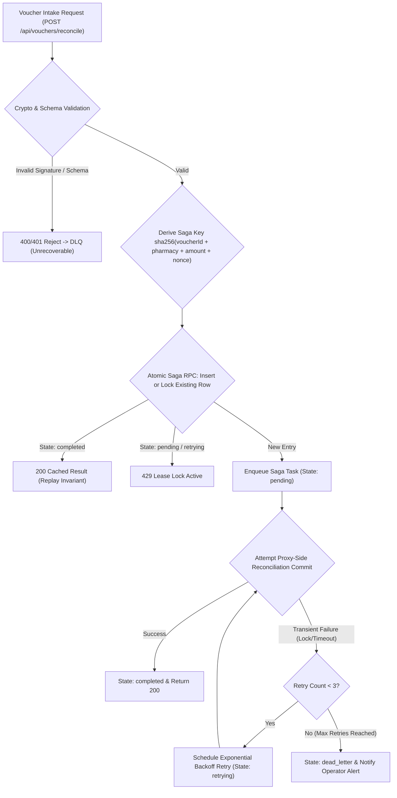

# Phase 4 Local Prototype: Durable Offline Voucher Settlement Saga Queue

> **Status**: LOCAL PROTOTYPE / PROOF-BOUNDED IMPLEMENTATION
> **Target Subsystem**: `server/createApp.js`, `supabase/schema.sql`, `supabase/migrations/20260813000000_voucher_settlement_saga.sql`
> **Evidence Lineage**: `[dirty working tree]`

---

## 1. Executive Summary & Problem Statement

When independent community pharmacies issue offline mutual credit vouchers, they submit asynchronous reconciliation requests to the Database API Proxy server. Under transient network outages, database write locks, or Supabase connection timeouts, naive HTTP intake endpoints either fail immediately or risk double-processing voucher intents upon client retries.

Phase 4 implements a **proxy-side durable Saga Queue with Dead-Letter Queue (DLQ)** mechanism to **target idempotent, exactly-once-style reconciliation semantics**, bounded retries, and clean fail-closed isolation.

This slice does **not** claim production on-chain settlement, a live broker-backed worker, or production exactly-once guarantees. The executable proof surface is the local proxy endpoint, Supabase RPC/schema design, and mocked Supabase unit tests.

---

## 2. Architecture & State Machine



---

## 3. Formal Invariants

| Invariant ID | Name | Constraint & Proof Boundary |
| :--- | :--- | :--- |
| **INV-SAGA-1** | **Strict Idempotency** | The saga key is derived from canonical voucher fields (`voucherId`, `pharmacyAddress`, `amount`, `clientNonce`) with explicit separators before SHA-256 hashing. Duplicate submissions return the previous execution result. |
| **INV-SAGA-2** | **Double-Processing Shield** | Before completing the proxy reconciliation, `voucher_saga_start` atomically reserves or locks the saga row by `saga_key` and compares the stored request hash. |
| **INV-SAGA-3** | **Bounded Retries** | Transient errors (e.g. 503/504 database connection timeouts) permit at most **3 automatic retries** with exponential backoff (1s, 2s, 4s). |
| **INV-SAGA-4** | **Unrecoverable Dead-Letter Isolation** | Payloads failing cryptographic verification, domain signatures, or exceeding 3 retries transition directly to `dead_letter` state and never regress to `pending`. |
| **INV-SAGA-5** | **Zero Identity Leakage** | All error responses emitted by the saga queue return generic error codes (`500 Database transaction failed` / `400 Invalid signature`) without exposing database hostnames, stack traces, or raw patient credentials. |
| **INV-SAGA-6** | **Multi-Instance Concurrency Shield** | Two proxy workers processing the same saga key concurrently must contend via atomic lease lock. Only one worker claims `pending` status; second worker receives `429 Lease Active` or cached terminal result. |
| **INV-SAGA-7** | **Multi-Tenant RLS Isolation** | Pharmacy A can only view and query its own saga queue entries (`auth.jwt() ->> 'wallet_address' = pharmacy_address`). Pharmacy B querying Pharmacy A entries receives empty results. |

---

## 4. Database / Ledger Schema (Supabase RLS Enforced)

```sql
CREATE TABLE IF NOT EXISTS public.voucher_settlement_saga (
  saga_key VARCHAR(64) PRIMARY KEY,
  request_hash VARCHAR(64) NOT NULL,
  voucher_id VARCHAR(66) NOT NULL,
  pharmacy_address VARCHAR(42) NOT NULL,
  amount NUMERIC(78, 0) NOT NULL,
  client_nonce VARCHAR(128) NOT NULL,
  status VARCHAR(20) NOT NULL CHECK (status IN ('pending', 'retrying', 'completed', 'dead_letter')),
  retry_count INTEGER NOT NULL DEFAULT 0,
  last_error VARCHAR(128),
  payload_json JSONB NOT NULL,
  result_json JSONB,
  created_at TIMESTAMPTZ NOT NULL DEFAULT timezone('utc'::text, now()),
  updated_at TIMESTAMPTZ NOT NULL DEFAULT timezone('utc'::text, now())
);

-- Row-Level Security (RLS) Policy
ALTER TABLE public.voucher_settlement_saga ENABLE ROW LEVEL SECURITY;

CREATE POLICY "Pharmacies can read own voucher saga entries"
  ON public.voucher_settlement_saga FOR SELECT
  USING (auth.jwt() ->> 'wallet_address' = pharmacy_address OR auth.role() = 'service_role');
```

---

## 5. Verification & Test Plan

1. **Unit Tests (`test/VoucherSagaQueue.test.js`)**:
   - Valid voucher reconciliation completes once and returns a cached result on duplicate submission.
   - Active lease contention returns `429 Voucher settlement lease active`.
   - Transient commit failures retry up to 3 times before DLQ transition.
   - Schema-valid signature failures route to `dead_letter` without leaking internals.
   - Outage responses remain sanitized (`500 Database transaction failed`).
   - Saga key derivation is boundary-safe across amount/client nonce combinations.
   - RLS/service-role schema text is present.
2. **Hardhat & Dossier Verification**:
   - `npx hardhat test test/VoucherSagaQueue.test.js`
   - `npx hardhat test test/server.test.js test/DisasterRecoveryOutage.test.js test/VoucherSagaQueue.test.js test/repo_knowledge_graph.test.js`
   - `python scripts/index_dossier_tree.py`
