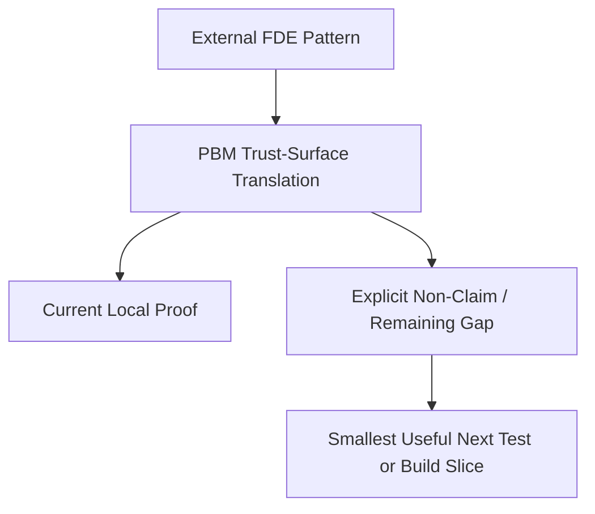

# Forward Deployed Engineering Reliability Mapping

> **Status**: DESIGN MAP / PROOF-BOUNDED ROADMAP
> **Domain**: Forward deployed engineering patterns translated into Pharmacy Fiduciary Commons reliability work
> **Evidence Lineage**: `[dirty working tree]`

This document maps 12 Forward Deployed Engineering (FDE) patterns onto the repository as inspiration and prioritization guidance. It is not a claim that the prototype is enterprise deployed, production hardened, HIPAA compliant, or integrated with customer systems.

---

## 1. Translation Rule

Borrow the FDE posture, not enterprise theater:

Each row below separates:

- **Current local proof**: what is backed by current code, docs, or tests.
- **Next useful build**: the smallest project-relevant next slice.
- **Non-claim**: what the repo must not imply yet.

The non-claims in this document are guarded by explicit non-claim tests in `test/fde_enterprise_mapping.test.js`.

---

## 2. FDE Mapping Matrix

| FDE Pattern | PBM Translation | Current Local Proof | Next Useful Build | Explicit Non-Claim |
| :--- | :--- | :--- | :--- | :--- |
| **P1: Multi-Tenant SaaS Platform** | Pharmacy tenant isolation and RLS-style access boundaries | `test/server.test.js` includes simulated voter/profile and claim tenant isolation checks. `supabase/schema.sql` defines saga-row pharmacy-owner or service-role RLS. | Add live Supabase policy execution tests before any production deployment claim. | No full SaaS platform, billing, or production tenant administration is claimed. |
| **P2: Enterprise SSO Integration** | Cryptographic request intent and role-bound authorization | `server/createApp.js` and `test/server.test.js` cover EIP-191 voter signatures and EIP-712 issuer/relayer domain checks. | Add operator identity/runbook mapping for council, guardian, relayer, and pharmacy support roles. | No OAuth2, SAML, SCIM, or enterprise SSO implementation is claimed. |
| **P3: Customer Connector Pack** | Bounded adapters for model sensors and future provider integrations | `review-context/repo_knowledge_graph.json` and control-plane docs define bounded model sensor roles. | Add provider capability checks as read-only evidence sensors with JSON schema validation. | No Salesforce, Slack, HubSpot, Google Workspace, or customer connector pack is claimed. |
| **P4: Secure Customer RAG System** | Permission-aware dossier retrieval and citation-bounded review packets | `scripts/index_dossier_tree.py` audits a 13-document PageIndex target set for status contradictions. | Add disclosure-class filtering to review packet retrieval and fail if local-only material enters public packets. | Not a production RAG system, vector search engine, or customer document permission layer. |
| **P5: Real-Time Data Sync and Conflict Resolution** | Durable voucher settlement saga with idempotent retries and DLQ | `POST /api/vouchers/reconcile`, `voucher_saga_*` RPCs, and `test/VoucherSagaQueue.test.js` cover duplicate submission, retry, DLQ, and lease contention in a local prototype. | Add real database integration tests and on-chain settlement worker tests before production settlement claims. | No production CRM/ERP sync engine, live broker, or production exactly-once settlement guarantee is claimed. |
| **P6: Embedded Analytics Dashboard** | Scoped observability for solvency and system health | `GET /api/health/observability` returns an honest envelope with `live_contract_reads: false`; `test/Phase6Operationalization.test.js` verifies local saga counts, DLQ alerting, rate-limit contracts, and redaction. | Add live Supabase metric readers or Prometheus/OpenTelemetry export only after integration tests exist. | No live solvency dashboard, production analytics product, or live Supabase metric reader is claimed. |
| **P7: API Gateway with Contract-Based Rate Limiting** | Proxy guardrails, request caps, idempotency leases, and sanitized outage failures | `server/createApp.js`, `test/server.test.js`, and `test/DisasterRecoveryOutage.test.js` cover payload caps, depth rejection, leases, and sanitized 500s. | Add per-tenant/per-role quota contracts and rate-limit telemetry tests. | No dynamic SLA billing, contract overage automation, or production gateway is claimed. |
| **P8: Customer-Specific Workflow Orchestrator** | Single-agent control plane with bounded investigation loop | `docs/plans/single_agent_control_plane_review_loop.md` and `review-context/repo_knowledge_graph.json` specify the 7-step review loop. | Add CLI entrypoint that loads only a graph neighborhood for a selected signal. | No production workflow orchestrator or autonomous executor is claimed. |
| **P9: Privacy-Preserving Data Pipeline** | Credential blinding, response redaction, and forbidden-field boundaries | `server/createApp.js` applies HMAC credential blinding; DR tests assert secret strings are absent from error payloads. | Add DLP-style fixtures for support prompts, exported packets, PHI placeholders, witness material, and raw credentials. | Not a HIPAA compliance engine, PHI classifier, or full DLP system. |
| **P10: Self-Service Customer Admin Portal** | Operator-facing authority model and approval gates | `.agents/AGENTS.md` defines L1/L2/L3 authority boundaries; tests preserve the L3 git/deploy gate language. | Build an operator checklist or status page after backend proof surfaces stabilize. | No self-service admin portal is implemented. |
| **P11: Deployment Profiler and RCA Engine** | Failure memories, advisory receipts, and rehearsal-based risk scoring | `scripts/rehearse_proposal.py`, `docs/ops/KNOWN_FAILURE_POSTMORTEMS.md`, and tests cover advisory receipts and historical risk detection. | Add request-lifecycle trace receipts for registration, relay intake, and future voucher settlement. | No distributed tracing platform, production RCA engine, or live deployment profiler is claimed. |
| **P12: Automated Onboarding and Provisioning Engine** | Preflight checks and context hygiene gates | `scripts/context_hygiene_audit.py` emits `pbm.context_hygiene_audit.v1`; focused guardrail tests cover context hygiene, graph integrity, and authority boundaries. | Wire context hygiene into the master verification runner after this slice is accepted. | No IaC provisioning engine, automated customer environment setup, or go-live automation is claimed. |

---

## 3. Best Next Slice

The FDE mapping reinforces the current execution order:

1. **Finish advisory control-plane hygiene**: keep rehearsal receipts, graph boundaries, and context hygiene deterministic.
2. **Verify Phase 4 voucher saga locally**: duplicate voucher submission, retry-to-DLQ, and multi-instance lease contention.
3. **Verify Phase 6 FDE-grade operationalization locally**: queue depth, retry counts, DLQ counts, and sanitized RCA receipts are prototype-scoped until live database readers exist.
4. **Defer enterprise surfaces**: SSO, connectors, self-service portals, billing, and provisioning are not core until the fiduciary settlement path is stronger.

Phase 4 voucher saga implementation precedes Phase 6 FDE-grade operationalization, and Phase 6 remains local/prototype-scoped until live metric readers are separately implemented and tested.

---

## 4. Verification Language

When reporting this artifact, use:

- "FDE patterns mapped to PBM trust surfaces."
- "Current proof is local and prototype-scoped."
- "Focused control-plane, voucher-saga, and operational telemetry guardrail slice."
- "Customer connectors, enterprise SSO, admin portal, DLP compliance, production data sync, and automated provisioning remain non-claims unless separately implemented and tested."
