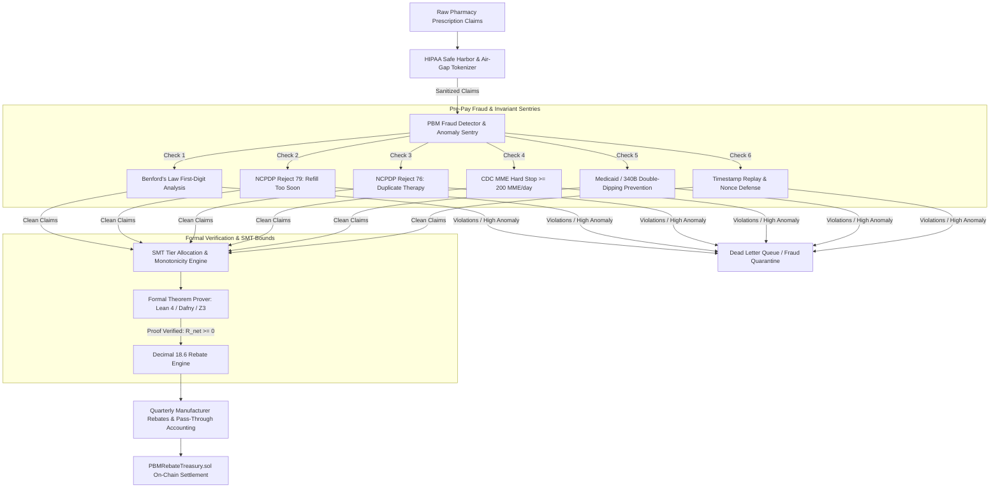

# Specialized Council Handoff: PBM Rebate & Claims Governance Engine

**Domain:** Pharmacy Benefit Manager (PBM) Claims Adjudication, Rebate Transparency, Fraud Detection, Formal Math Proofs  
**Primary Substrates:** `council_engine` (Python) + Lean4 / SMT Z3 Formal Prover  
**Contract Version:** `CONTRACT_VERSION 4.7.0` (Sections 18, 19, 20)

---

## 1. Architectural Overview & Workflow



---

## 2. Council Best Practices & Operating Principles

1. **Mathematical Invariant Bounds**:
   * Formally verify that net manufacturer rebate cannot be negative after administrative fee deduction:
     $$R_{\text{net}} = R_{\text{gross}} - F_{\text{admin}} \ge 0$$
   * Invariant verified via `FormalTheoremProverEngine` using SMT Z3 constraint solvers and Lean4 theorem skeletons before financial claim settlement.
   * Decimal arithmetic uses `Decimal(18, 6)` Banker's Rounding (`ROUND_HALF_EVEN`) to eliminate floating-point drift.

2. **Duplicate Discount & 340B Governance**:
   * Cross-checks NDC/NPI claims against Medicaid Drug Rebate Programs (MDRP) and 340B Covered Entity registries (HRSA Office of Pharmacy Affairs).
   * Prevents statutory double-dipping where manufacturers are improperly invoiced for both 340B ceiling prices and commercial rebates on the same dispensation.

3. **Statistical Anomaly Sentries & Benford's Law**:
   * Runs Benford's Law distribution tests on claim billing amounts:
     $$P(d) = \log_{10}\left(1 + \frac{1}{d}\right), \quad d \in \{1, \dots, 9\}$$
   * Flags suspicious clustering ($p < 0.01$) indicating synthetic claim generation or split billing.
   * Tracks claim timestamp collision patterns, NPI-prescriber collusion indices (Herfindahl-Hirschman Index), and NCPDP Reject 79 (Refill Too Soon), Reject 76 (Duplicate Therapy), and CDC Morphine Milligram Equivalent ($\text{MME} \ge 200/\text{day}$) safety stops.

---

## 3. Agent & Model Rotations

| Seat / Role | Assigned Models | Dispatch Mode | Specialization & Boundary |
| :--- | :--- | :--- | :--- |
| **Formal Logic & SMT Prover** | `deepseek-r1`, `mistral:latest` | SMT / Z3 Python Backend | Generates formal proof invariants, checks arithmetic edge cases, proves non-negativity and tier monotonicity. |
| **Claims & Rebate Auditor** | `codex-5.5`, `qwen2.5-coder:7b` | Structured JSON Verifier | Validates DIR fee clawbacks, WAC/AWP spread calculations, and formulary tier compliance. |
| **Fraud Sentry & Anomaly Auditor** | `pbm_fraud_detector.py` | Local Statistical Engine | Unsupervised anomaly detection, Benford's Law analysis, and prescriber-pharmacy clustering. |
| **Pass-Through Settlement Engine** | `pbm_rebate_engine.py` | Deterministic Decimal(18,6) | Calculates gross rebates, admin fee splits, 30-day equivalent normalization, and inflation penalties. |

---

## 4. Key Copy-Paste File Paths

### A. Scratch Council Engine Substrates
```text
C:\Users\Josh\.gemini\antigravity\scratch\council_engine\pbm_rebate_engine.py
C:\Users\Josh\.gemini\antigravity\scratch\council_engine\test_pbm_rebate_engine.py
C:\Users\Josh\.gemini\antigravity\scratch\council_engine\pbm_fraud_detector.py
C:\Users\Josh\.gemini\antigravity\scratch\council_engine\test_pbm_fraud_detector.py
C:\Users\Josh\.gemini\antigravity\scratch\council_engine\formal_theorem_prover_engine.py
C:\Users\Josh\.gemini\antigravity\scratch\council_engine\test_formal_theorem_prover_engine.py
C:\Users\Josh\.gemini\antigravity\scratch\council_engine\pbm_rebate_blueprint.md
C:\Users\Josh\.gemini\antigravity\scratch\council_engine\pbm_claims_fraud_audit_spec.md
C:\Users\Josh\.gemini\antigravity\scratch\council_engine\lean4_dafny_formal_prover_spec.md
```

### B. Promoted Repository Substrates (`tools/council/` & `contracts/`)
```text
C:\Users\Josh\Desktop\PBMRebateTreasuryFinal\tools\council\pbm_rebate_engine.py
C:\Users\Josh\Desktop\PBMRebateTreasuryFinal\tools\council\pbm_fraud_detector.py
C:\Users\Josh\Desktop\PBMRebateTreasuryFinal\tools\council\formal_theorem_prover_engine.py
C:\Users\Josh\Desktop\PBMRebateTreasuryFinal\tools\council\council_contracts.py
C:\Users\Josh\Desktop\PBMRebateTreasuryFinal\contracts\PBMRebateTreasury.sol
C:\Users\Josh\Desktop\PBMRebateTreasuryFinal\contracts\PharmacyMutualCredit.sol
C:\Users\Josh\Desktop\PBMRebateTreasuryFinal\test\CouncilEngineModules.test.js
```
