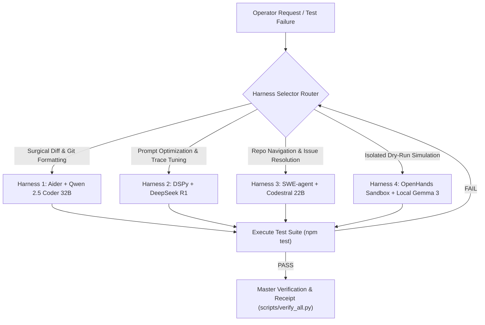

# Multi-Modal OSS Rotating Roles & Agent Harness Combinations

**Repository**: `Pharmacy-Fiduciary-Commons`  
**Schema**: `pbm-multimodal-harness/v1.0`  
**Purpose**: Coordinate multi-modal OSS model lanes with deterministic harnesses for review, verification, disagreement mining, and evidence capture. The harness does not authorize autonomous source edits, commits, pushes, deployments, signing, role changes, or fund movement.

---

## 1. Multi-Modal OSS Rotating Roles Matrix

| Role ID | Persona & Focus Domain | Primary Multi-Modal Model | Fallback OSS Model | Input Types Scanned |
| :--- | :--- | :--- | :--- | :--- |
| `visual_ui_auditor` | UI Design System & Brand Gate B Auditor | **Google Gemma 3 12B / StepFun Step-2** | `google/gemma-4-31b-it:free` | Screenshots, CSS layouts, inline DOM structures. |
| `diagram_architecture_critic` | Mermaid & Sequence Diagram Verifier | **Xiaomi MiMo / StepFun Step-1** | `openrouter/free` | Mermaid flowcharts, architecture diagrams, sequence logs. |
| `adversarial_redteam_probe` | Edge-Case & Prompt Injection Hunter | **xAI Grok-2 / DeepSeek R1 671B** | `deepseek/deepseek-r1:free` | Circuit inputs, API boundary schemas, attack traces. |
| `formal_contract_checker` | Solidity Accounting & Solvency Auditor | **Poolside Laguna / Qwen 2.5 Coder 32B** | `meta-llama/llama-3.3-70b-instruct:free` | Hardhat trace logs, AST representations, reentrancy guards. |
| `privacy_zk_validator` | Circom Signal & Nullifier Auditor | **Anthropic Claude 3.7 / DeepSeek V3** | `openrouter/free` | R1 CS constraint matrices, Poseidon hash trees, witness JSON. |

---

## 2. Candidate Model Experiment Registry

These model lanes are experimental until a run records availability, output quality, cost, and whether the results survived live repo reconciliation. Status vocabulary: `candidate`, `available_local_user_reported`, `candidate_routed_to_current_catalog_alternative`, `candidate_needs_exact_model`, `candidate_needs_backend_or_route`, `available`, `attempted`, `unavailable`, `excelling`, `noisy`, `retired`.

| Model ID | Initial Status | Best-Fit Lens |
| :--- | :--- | :--- |
| `gemma3:4b` | `available_local_user_reported` | Local/offline sanity pass and cheap regression triage. |
| `qwen2.5-coder:7b` | `available_local_user_reported` | Local code-path review and implementation-diff criticism. |
| `mistral` | `available_local_user_reported` | Fast local second-opinion and regression triage. |
| `llama-audit` | `available_local_user_reported` | Local security and audit-focused critic. |
| `deepseek-r1:1.5b` | `available_local_user_reported` | Local small reasoning sanity pass and invariant spot-checking. |
| `deepseek-r1:7b` | `candidate_needs_local_install_confirmation` | Reasoning model JSON adapter experiment. |
| `glm4:latest` | `available_local_user_reported` | Local OpenAI-compatible generalist and governance synthesis pass. |
| `claude-3-7-sonnet` | `candidate` | Governance wording calibration and overclaim detection. |
| `smaug-72b` | `candidate_needs_backend_or_route` | Broad open-weight critic and alternate reasoning pass. |
| `x-ai/grok-2` | `candidate` | Adversarial disagreement hunting and edge-case pressure. |
| `nvidia/nemotron-70b` | `candidate_routed_to_current_catalog_alternative` | Structured security and enterprise risk review. |
| `deepseek-r1` | `candidate` | Formal reasoning, invariants, and proof-step criticism. |
| `gemini-2.5-pro` | `candidate` | Long-context synthesis, diagrams, and multimodal review. |
| `inclusion-ai` | `candidate_needs_exact_model` | Alternate policy and stakeholder-impact lens. |
| `moonshot-k2` | `candidate_routed_to_current_catalog_alternative` | Long-context document contradiction mining. |
| `moonshotai/kimi-k2.7-code` | `candidate` | Kimi code-focused review and patch critique. |
| `moonshotai/kimi-k3` | `candidate` | Kimi long-context synthesis and contradiction mining. |
| `moonshotai/kimi-k2-thinking` | `candidate` | Kimi reasoning pass for proof-step disagreement. |
| `liquid-ai/lfm-40b` | `candidate` | Efficient generalist second-opinion pass. |
| `magic-dev` | `candidate_needs_exact_model` | Implementation-diff proposal and code rewrite lane. |
| `minimax-abab6.5t` | `candidate_needs_exact_model` | Planning, synthesis, and handoff clarity pass. |

The loop should record `unavailable` only after an actual attempted dispatch or local invocation fails. Missing local review text is tracked separately as a scan artifact gap, not as a model outage.

### Route Aliases

The ledger records both the operator-facing `model_id` and the backend `routed_model_id`. Current OpenRouter route candidates:

| Model ID | Routed Model ID |
| :--- | :--- |
| `gemma3:4b` | `gemma3:4b` via local OpenAI-compatible endpoint |
| `qwen2.5-coder:7b` | `qwen2.5-coder:7b` via local OpenAI-compatible endpoint |
| `mistral` | `mistral` via local OpenAI-compatible endpoint |
| `llama-audit` | `llama-audit` via local OpenAI-compatible endpoint |
| `deepseek-r1:1.5b` | `deepseek-r1:1.5b` via local OpenAI-compatible endpoint |
| `deepseek-r1:7b` | `deepseek-r1:7b` via local OpenAI-compatible endpoint |
| `glm4:latest` | `glm4:latest` via local OpenAI-compatible endpoint |
| `claude-3-7-sonnet` | `~anthropic/claude-sonnet-latest` |
| `x-ai/grok-2` | `~x-ai/grok-latest` |
| `nvidia/nemotron-70b` | `nvidia/nemotron-3-super-120b-a12b` |
| `deepseek-r1` | `deepseek/deepseek-r1` |
| `gemini-2.5-pro` | `google/gemini-2.5-pro` |
| `moonshot-k2` | `moonshotai/kimi-k2` |
| `moonshotai/kimi-k2.7-code` | `moonshotai/kimi-k2.7-code` |
| `moonshotai/kimi-k3` | `moonshotai/kimi-k3` |
| `moonshotai/kimi-k2-thinking` | `moonshotai/kimi-k2-thinking` |
| `liquid-ai/lfm-40b` | `liquid/lfm-40b` |
| `smaug-72b` | unresolved backend route |
| `magic-dev` | unresolved exact model |
| `minimax-abab6.5t` | unresolved exact model |
| `inclusion-ai` | unresolved exact model |

---

## 3. Empirical Model Attempt Ledger

Model usefulness is measured through durable attempts, not roster presence. A model attempt records:

- `model_id`, `routed_model_id`, backend, reviewer role, packet, disclosure class, and timestamp.
- unique review output under `reviews/model_attempts/`.
- unique router metadata under `reviews/model_attempts/`.
- appended JSONL receipt under `reviews/model_attempt_ledger.jsonl`.
- partial model receipt updated after each seat under `cache/multimodal_harness_partial_receipt.json`.
- status: `planned_dry_run`, `review_passed`, `review_failed_invalid_json`, `attempt_failed`, `skipped_completed`, or `blocked`.
- extracted claim count and `unreconciled_raw_output` status until live files/tests falsify or confirm the claim.
- model execution profile: `review_usable`, `json_reliability`, `expected_latency_band`, `preferred_lens`, and `avoid_for`.

Local attempts may use the local OpenAI-compatible loopback endpoint (`--attempt-models local`, default `http://localhost:11434/v1`) or native Ollama (`--model-backend ollama`). OpenRouter/cloud attempts require both `--model-backend openrouter` and exact `--approve-disclosure <PACKET_CLASS>`. `LOCAL_CODE_DIRTY` packets are not routed externally by default.

### Local Fast CPU Review Profile

`--local-fast` is the preferred local CPU quorum mode for Gemma/Qwen/Llama-audit style passes. It uses a smaller packet window, JSON-only output, a maximum of 2 findings, a 900-token output cap, and a 900-second local request timeout. The default `local-fast` selector currently dispatches four local seats: `gemma3:4b`, `qwen2.5-coder:7b`, `llama-audit`, and `glm4:latest`.

Acceptance target: 2-4 local reviewers submit parseable JSON under the configured timeout. A callable model that fails JSON validation remains evidence, but is not counted as review-usable. Use `--min-model-successes 2` for the first quorum gate, then raise it only after the local roster proves stable.

### Partial Receipts And Resume

Model-attempt receipts are written incrementally to `cache/multimodal_harness_partial_receipt.json`. If a six-seat council times out or is interrupted, completed seats remain visible with statuses and output paths. `--resume-model-attempts` skips prior matching `review_passed` attempts from `reviews/model_attempt_ledger.jsonl`; JSON-required runs only skip prior attempts that also recorded `json_valid: true`.

### DeepSeek R1 JSON Adapter

`--reasoning-json-adapter` adds a stricter final-JSON prompt for reasoning models. The `r1-json` selector targets `deepseek-r1:7b`; use `--repeat-attempts 2` to determine whether it can submit valid JSON twice. Until two valid JSON trials pass, DeepSeek R1 remains quarantined for routine council-loop use, with the receipt distinguishing local endpoint/install failures from callable-but-invalid JSON output.

---

## 4. Developer Agent Harness Combinations for Review/Verification Loops



### Combination 1: Surgical Diff Generation Engine
- **Harness**: **Aider (`git_diff_engine`) + Qwen 2.5 Coder 32B**
- **Loop Strategy**: Ingests line-anchored test failures, generates minimal multi-file diffs, formats clean conventional git commits.
- **Verification Rule**: Must pass `npx hardhat test` before staging diff.

### Combination 2: Execution-Trace Prompt Compiler
- **Harness**: **DSPy (`prompt_compiler`) + DeepSeek R1**
- **Loop Strategy**: Captures execution trace logs from `scripts/verify_all.py` and auto-tunes system prompts to eliminate ambiguity.
- **Verification Rule**: Must pass Constitutional Rubric Evaluator (`scripts/eval_constitutional_rubric.py`).

### Combination 3: Full Repository Issue Resolver
- **Harness**: **SWE-agent (`github_issue_resolver`) + Mistral Codestral 22B**
- **Loop Strategy**: Reads high-level feature issues, maps cross-file dependencies via PageIndex, executes build commands (`npm run build:dashboard`).
- **Verification Rule**: Must pass Brand Gate B linter (`npm run check:frontend`).

### Combination 4: Local Isolated Container Sandbox
- **Harness**: **OpenHands (`sandbox_executor`) + Local Gemma 3 (Ollama port 11434)**
- **Loop Strategy**: Runs offline dry-run simulations inside isolated Docker container loopbacks.
- **Verification Rule**: Zero external network egress during test loop execution.

---

## 5. Local Review Artifact Matching

Offline synthesis scans existing local reviewer outputs only; it does not call models. Review lane filenames may use underscores or hyphens, so `grok_council` and `grok-council` resolve to the same local artifact family. Missing artifacts are recorded as `missing_lanes` in the harness receipt and should not be described as unavailable models.

---

## 6. Rotational Loop Execution Command Reference

```bash
# Plan all configured deterministic harness checks and reviewer lanes
python scripts/multimodal_swarm_harness.py --mode dry-run --all-harnesses --offline

# Run a lightweight local execute path against an existing packet
python scripts/multimodal_swarm_harness.py --mode execute --harness dspy-deepseek --role formal_contract_checker --packet review-context/packet-solvency-debt.json --offline

# Compile a bounded packet before optional reviewer dispatch
python scripts/multimodal_swarm_harness.py --mode execute --role privacy_zk_validator --question "Is the VoteNullifier path safe against replay and identity leakage?" --files circuits/vote_nullifier.circom test/ZKNullifierFixtureGate.test.js IDENTITY_NULLIFIER_DESIGN.md --offline

# Dispatch external reviewer lanes only after exact disclosure approval
python scripts/multimodal_swarm_harness.py --mode execute --role formal_contract_checker --packet review-context/packet-solvency-debt.json --run-reviewers --approve-disclosure PUBLIC_COMMITTED

# Attempt a local model and record empirical artifacts
python scripts/multimodal_swarm_harness.py --mode execute --harness openhands-gemma3 --packet review-context/packet-db-proxy.json --attempt-models local --offline

# Run the bounded local CPU quorum and require parseable JSON
python scripts/multimodal_swarm_harness.py --mode execute --harness openhands-gemma3 --packet review-context/packet-openrouter-public-baseline.json --attempt-models local-fast --local-fast --require-json-reviews --min-model-successes 2 --offline

# Resume a partially completed local quorum from the model attempt ledger
python scripts/multimodal_swarm_harness.py --mode execute --harness openhands-gemma3 --packet review-context/packet-openrouter-public-baseline.json --attempt-models local-fast --local-fast --require-json-reviews --min-model-successes 2 --resume-model-attempts --offline

# Test whether DeepSeek R1 7B can produce two valid final-JSON reviews
python scripts/multimodal_swarm_harness.py --mode execute --harness openhands-gemma3 --packet review-context/packet-openrouter-public-baseline.json --attempt-models r1-json --reasoning-json-adapter --require-json-reviews --repeat-attempts 2 --offline

# Record blocked external attempts without sending dirty code
python scripts/multimodal_swarm_harness.py --mode execute --harness openhands-gemma3 --packet review-context/packet-db-proxy.json --attempt-models all --model-backend openrouter --offline
```
