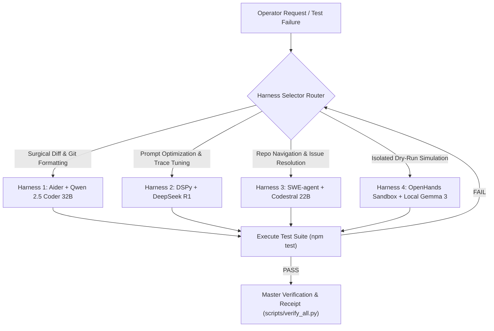

# Multi-Modal OSS Rotating Roles & Agent Harness Combinations

**Repository**: `Pharmacy-Fiduciary-Commons`  
**Schema**: `pbm-multimodal-harness/v1.0`  
**Purpose**: Coordinate multi-modal OSS model lanes with deterministic harnesses for review, verification, disagreement mining, and evidence capture. The harness does not authorize autonomous source edits, commits, pushes, deployments, signing, role changes, or fund movement.

---

## 1. Multi-Modal OSS Rotating Roles Matrix

| Role ID | Persona & Focus Domain | Primary Multi-Modal Model | Fallback OSS Model | Input Types Scanned |
| :--- | :--- | :--- | :--- | :--- |
| `visual_ui_auditor` | UI Design System & Brand Gate B Auditor | **Google Gemma 3 12B / StepFun Step-2** | `google/gemma-4-31b-it:free` | Screenshots, CSS layouts, inline DOM structures. |
| `diagram_architecture_critic` | Mermaid & Sequence Diagram Verifier | **Xiaomi MiMo / StepFun Step-1** | `openrouter/free` | Mermaid flowcharts, architecture diagrams, sequence logs. |
| `adversarial_redteam_probe` | Edge-Case & Prompt Injection Hunter | **xAI Grok-2 / DeepSeek R1 671B** | `deepseek/deepseek-r1:free` | Circuit inputs, API boundary schemas, attack traces. |
| `formal_contract_checker` | Solidity Accounting & Solvency Auditor | **Poolside Laguna / Qwen 2.5 Coder 32B** | `meta-llama/llama-3.3-70b-instruct:free` | Hardhat trace logs, AST representations, reentrancy guards. |
| `privacy_zk_validator` | Circom Signal & Nullifier Auditor | **Anthropic Claude 3.7 / DeepSeek V3** | `openrouter/free` | R1 CS constraint matrices, Poseidon hash trees, witness JSON. |

---

## 2. Developer Agent Harness Combinations for Review/Verification Loops



### Combination 1: Surgical Diff Generation Engine
- **Harness**: **Aider (`git_diff_engine`) + Qwen 2.5 Coder 32B**
- **Loop Strategy**: Ingests line-anchored test failures, generates minimal multi-file diffs, formats clean conventional git commits.
- **Verification Rule**: Must pass `npx hardhat test` before staging diff.

### Combination 2: Execution-Trace Prompt Compiler
- **Harness**: **DSPy (`prompt_compiler`) + DeepSeek R1**
- **Loop Strategy**: Captures execution trace logs from `scripts/verify_all.py` and auto-tunes system prompts to eliminate ambiguity.
- **Verification Rule**: Must pass Constitutional Rubric Evaluator (`scripts/eval_constitutional_rubric.py`).

### Combination 3: Full Repository Issue Resolver
- **Harness**: **SWE-agent (`github_issue_resolver`) + Mistral Codestral 22B**
- **Loop Strategy**: Reads high-level feature issues, maps cross-file dependencies via PageIndex, executes build commands (`npm run build:dashboard`).
- **Verification Rule**: Must pass Brand Gate B linter (`npm run check:frontend`).

### Combination 4: Local Isolated Container Sandbox
- **Harness**: **OpenHands (`sandbox_executor`) + Local Gemma 3 (Ollama port 11434)**
- **Loop Strategy**: Runs offline dry-run simulations inside isolated Docker container loopbacks.
- **Verification Rule**: Zero external network egress during test loop execution.

---

## 3. Rotational Loop Execution Command Reference

```bash
# Plan all configured deterministic harness checks and reviewer lanes
python scripts/multimodal_swarm_harness.py --mode dry-run --all-harnesses --offline

# Run a lightweight local execute path against an existing packet
python scripts/multimodal_swarm_harness.py --mode execute --harness dspy-deepseek --role formal_contract_checker --packet review-context/packet-solvency-debt.json --offline

# Compile a bounded packet before optional reviewer dispatch
python scripts/multimodal_swarm_harness.py --mode execute --role privacy_zk_validator --question "Is the VoteNullifier path safe against replay and identity leakage?" --files circuits/vote_nullifier.circom test/ZKNullifierFixtureGate.test.js IDENTITY_NULLIFIER_DESIGN.md --offline

# Dispatch external reviewer lanes only after exact disclosure approval
python scripts/multimodal_swarm_harness.py --mode execute --role formal_contract_checker --packet review-context/packet-solvency-debt.json --run-reviewers --approve-disclosure PUBLIC_COMMITTED
```
