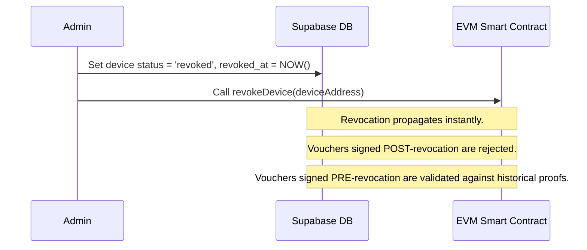

# Architectural Specification: Asymmetric Voucher Validation & Compromise Containment

This dossier specifies the transition of the **Pharmacy Fiduciary Commons** offline voucher system from a shared symmetric HMAC-SHA256 model to an asymmetric cryptographic signature model. 

---

## Executive Summary & Security Risk Analysis

The current offline voucher implementation relies on a shared symmetric secret (`app.settings.voucher_secret` in PostgreSQL and `LOCAL_MAC_SECRET` in Node.js) to compute a truncated 64-bit HMAC. This design exhibits severe security vulnerabilities:
1. **Single Point of Complete System Compromise**: If the symmetric secret is leaked or extracted from a single offline coordinator or pharmacy terminal, the entire voucher system is compromised. An attacker can forge valid vouchers for any pharmacy or patient.
2. **Inability to Trace or Attribute Actions**: Since all devices share the same key, it is impossible to determine which device generated a given voucher, preventing audit trails and accountability.
3. **All-or-Nothing Revocation**: If a compromise is detected, the only remedy is rotating the global symmetric secret. This immediately invalidates *all* pending offline vouchers across *all* honest devices, causing severe disruptions to patient care continuity.
4. **Metadata Leakage & Replay Vulnerabilities**: The existing MAC does not bind device identity, sequence numbers, or cryptographic history, making the system susceptible to replay attacks, backdating, and unauthorized copying.

### The Asymmetric Solution
Transitioning to an asymmetric model ensures that:
- Each client device/coordinator holds a **unique private key** and registers its public key.
- Vouchers are signed individually, enabling **cryptographic attribution**.
- If a device is compromised, **only its public key is revoked**, leaving other devices unaffected.
- **Monotonic sequence numbers**, **epoch-scoped nonces**, and **hash chaining** prevent post-compromise backdating and forgery.

---

## 1. Asymmetric Cryptographic Signature Model

The system supports two complementary asymmetric cryptographic standards to balance offline performance and EVM-compatibility:

```mermaid
flowchart TD
    subgraph Client Device (Offline)
        A[Generate Key Pair] --> B[ECDSA secp256k1 or Ed25519]
        B --> C[Sign Voucher Payload]
    end
    subgraph DB Proxy / Supabase
        C -->|Upload Batch| D[PL/pgSQL Trigger]
        D -->|Lookup Public Key| E[trusted_devices Table]
        E -->|Verify Signature| F{pg_sodium or ecrecover}
        F -->|Valid & Active| G[Queue for On-Chain Settlement]
        F -->|Invalid or Revoked| H[Reject Voucher]
    end
```

### 1.1 Local Key Pair Generation
* **Ed25519**: Highly performant, side-channel resistant, and produces compact 64-byte signatures. Perfect for resource-constrained offline devices. Already supported in the repository's credential module.
* **ECDSA secp256k1**: Standard Ethereum curve. Enables direct, gas-efficient on-chain verification via EVM `ecrecover` (~3,000 gas). Public keys map directly to Ethereum addresses, allowing integration into smart contracts as a standard participant address.

**Device-Local Generation Example (Node.js)**:
```javascript
import crypto from 'node:crypto';

// For Ed25519 (Database-Proxy Validation)
const generateEd25519 = () => {
  const { publicKey, privateKey } = crypto.generateKeyPairSync('ed25519', {
    privateKeyEncoding: { format: 'pem', type: 'pkcs8' },
    publicKeyEncoding: { format: 'pem', type: 'spki' }
  });
  return { publicKey, privateKey };
};

// For secp256k1 (Direct EVM Smart Contract Validation)
const generateSecp256k1 = () => {
  const { publicKey, privateKey } = crypto.generateKeyPairSync('ec', {
    namedCurve: 'secp256k1',
    privateKeyEncoding: { format: 'pem', type: 'pkcs8' },
    publicKeyEncoding: { format: 'pem', type: 'spki' }
  });
  return { publicKey, privateKey };
};
```

### 1.2 Voucher Payload Schema
We replace the `mac` field with structured fields representing device context and signature:

```json
{
  "roundId": 1,
  "preimage": "0x4e61b1...",
  "nullifier": "0x5f9a2c...",
  "generatedAt": "2026-07-21T16:39:49.000Z",
  "status": "pending_sync",
  "proofFormat": "offline-voucher-v2-asymmetric",
  "warning": "preimage is bearer recovery material; voter identity is not stored in voucher artifact",
  "deviceId": "dev_fiduciary_coop_01",
  "sequenceNumber": 142,
  "epochId": 165,
  "parentHash": "0x9c3f1e...",
  "signature": "0x8a7b6c..."
}
```

### 1.3 Serialization & Canonicalization
To prevent signature mismatch due to whitespace or key ordering variance, the payload is canonicalized prior to signing. The serialization process:
1. Filters out the `signature` and `status` fields.
2. Recursively sorts keys alphabetically.
3. Formats the output as a minified JSON string or hashes the packed binary parameters.

---

## 2. Compromise Containment & Key Revocation

When a device is lost or compromised, its signing authority must be terminated immediately across both Web2 and Web3 surfaces.



### 2.1 Web2 Database Registry (`trusted_devices`)
A new relational table in PostgreSQL maintains active device states:
* Vouchers signed by a device marked `revoked` are rejected at the database trigger boundary.
* A revocation threshold sequence number can be specified to protect past honest signatures.

### 2.2 On-Chain Smart Contract Registry (`DeviceRegistry.sol`)
A decentralized registry smart contract manages the trusted device set:
* **Storage Mapping**: `mapping(address => DeviceStatus) public devices;`
* **Status Struct**:
  ```solidity
  struct DeviceStatus {
      bool isTrusted;
      uint256 revokedAtBlock;
      uint256 lastSequenceNumber;
  }
  ```
* **Governance Gate**: The `COUNCIL_ROLE` or local federation multisig calls `revokeDevice(address deviceAddress)` to write the revocation state.

### 2.3 Historical Signature Preservation
Discarding all historically signed vouchers during a device revocation causes severe financial loss to pharmacies and interrupts patient access. To safely validate vouchers signed *before* the compromise:
1. **Sequence Caps**: If the device operator knows the compromise occurred after sequence number $S$, the revocation registration records $S$ as the `revocationSequence`. Any voucher with a sequence number $seq \le S$ is accepted (subject to replay checks); any voucher with $seq > S$ is rejected.
2. **Epoch Exclusions**: Vouchers are restricted to active temporal epochs. If the compromise occurred in Epoch $N$, the device's keys are invalid for Epoch $N$ and all future epochs, while historical vouchers from Epochs $\le N-1$ remain verifiable.

---

## 3. Anti-Backdating & Forgery Prevention

If an attacker obtains a device's private key, they can forge vouchers and backdate the `generatedAt` timestamp to a period before the compromise occurred. The system mitigates this threat via a multi-layered verification chain:

### 3.1 Monotonic Sequence Numbers
* **Mechanism**: Every device maintains an internal counter. Vouchers are signed with `sequenceNumber`.
* **Database Check**: The database enforces that the sequence number of a new voucher must be strictly greater than the recorded sequence number for that device (`sequenceNumber > last_sequence`).
* **Attacker Block**: The attacker cannot forge vouchers for sequence numbers that have already been synchronized.

### 3.2 Epoch-Scoped Nonces
* **Mechanism**: The system operates in temporal epochs (e.g., 24-hour windows). At the start of each epoch $k$, the network publishes an epoch seed $S_k$.
* **Requirement**: The device must sign the current active $S_k$ inside the voucher payload.
* **Database Check**: The database only accepts vouchers with an `epochId` matching the current active epoch or the immediate predecessor (to allow for sync latency).
* **Attacker Block**: An attacker compromising a key in epoch $N$ cannot forge vouchers for epoch $N-2$ because the system rejects expired epochs, restricting the vulnerability window to the duration of the current epoch.

### 3.3 Cryptographic Hash Chaining
* **Mechanism**: Vouchers are linked together in a hash chain:
  $$\text{Payload}_i = \{ \text{fields}_i, \text{parentHash} = H_{i-1} \}$$
  $$H_i = \text{keccak256}(\text{Payload}_i, \text{Signature}_i)$$
* **Database Check**: The database tracks `last_hash` for each device. Any new voucher must prove its lineage by matching `parentHash == last_hash`.
* **Attacker Block**: The attacker cannot inject a forged voucher into the historical chain without breaking the cryptographic linkage. This completely freezes historical transactions.

### 3.4 Cooperative Time-Stamping (SMS/Proxy Relays)
* **Mechanism**: When a voucher is transmitted (via SMS, local gateway, or internet proxy), the receiving node co-signs the voucher payload with its own key and appends a `receiveTimestamp`.
* **Validation**: The DB and smart contract verify the co-signer's signature and assert that the difference between the device's declared timestamp and the relay's timestamp is within an acceptable margin.

---

## 4. Solidity & Database Schema Impact

### 4.1 Supabase Schema Modifications (`supabase/schema.sql`)

We add the `trusted_devices` table and update `offline_vouchers` to use asymmetric fields and signature validation.

```sql
-- DDL Updates

-- 1. Device Registry Table
CREATE TABLE IF NOT EXISTS public.trusted_devices (
    id UUID PRIMARY KEY DEFAULT gen_random_uuid(),
    device_id VARCHAR(100) NOT NULL UNIQUE,
    public_key VARCHAR(130) NOT NULL, -- Hex-encoded public key (Ed25519)
    status VARCHAR(20) DEFAULT 'active' NOT NULL, -- 'active', 'revoked'
    registered_at TIMESTAMP WITH TIME ZONE DEFAULT timezone('utc'::text, now()) NOT NULL,
    revoked_at TIMESTAMP WITH TIME ZONE,
    last_sequence INTEGER DEFAULT 0 NOT NULL,
    last_hash VARCHAR(66) DEFAULT '0x0000000000000000000000000000000000000000000000000000000000000000' NOT NULL,
    CONSTRAINT chk_device_status CHECK (status IN ('active', 'revoked'))
);

-- Indexing for fast device lookups
CREATE INDEX IF NOT EXISTS idx_trusted_devices_id ON public.trusted_devices(device_id);

-- 2. Modified Offline Vouchers Table
CREATE TABLE IF NOT EXISTS public.offline_vouchers (
    id UUID PRIMARY KEY DEFAULT gen_random_uuid(),
    user_id UUID NOT NULL REFERENCES auth.users(id) ON DELETE CASCADE,
    device_id VARCHAR(100) NOT NULL REFERENCES public.trusted_devices(device_id) ON DELETE RESTRICT,
    round_id INTEGER NOT NULL,
    preimage VARCHAR(66) NOT NULL, 
    nullifier VARCHAR(66) NOT NULL, 
    generated_at VARCHAR(50) NOT NULL, 
    status VARCHAR(50) NOT NULL, 
    proof_format VARCHAR(100) NOT NULL, 
    warning TEXT NOT NULL,
    sequence_number INTEGER NOT NULL,
    epoch_id INTEGER NOT NULL,
    parent_hash VARCHAR(66) NOT NULL,
    signature VARCHAR(130) NOT NULL, -- Hex-encoded signature prefixed with 0x
    uploaded_at TIMESTAMP WITH TIME ZONE DEFAULT timezone('utc'::text, now()) NOT NULL,
    CONSTRAINT chk_preimage_format CHECK (preimage ~* '^0x[a-f0-9]{64}$'),
    CONSTRAINT chk_nullifier_format CHECK (nullifier ~* '^0x[a-f0-9]{64}$'),
    CONSTRAINT chk_signature_format CHECK (signature ~* '^0x[a-f0-9]{128}$') -- 64-byte Ed25519 signature
);

-- RLS Policies
ALTER TABLE public.trusted_devices ENABLE ROW LEVEL SECURITY;

CREATE POLICY "Trusted devices are viewable by registered users" ON public.trusted_devices
    FOR SELECT USING (auth.role() = 'authenticated');

CREATE POLICY "Only admins and service roles can write to trusted_devices" ON public.trusted_devices
    FOR ALL USING (
        (auth.jwt() -> 'app_metadata'::text ->> 'role') = 'admin' OR 
        auth.role() = 'service_role'
    );
```

#### PL/pgSQL Trigger: Asymmetric Signature Verification using `pg_sodium`

```sql
CREATE OR REPLACE FUNCTION public.verify_voucher_signature()
RETURNS TRIGGER AS $$
DECLARE
  v_pubkey bytea;
  v_status varchar;
  v_revoked boolean;
  v_last_seq integer;
  v_last_hash varchar;
  v_raw_data text;
  v_verified boolean;
BEGIN
  -- 1. Fetch active device state with atomic row-level lock (FOR UPDATE)
  SELECT d.public_key, d.last_sequence, d.last_hash, (d.status = 'revoked')
  INTO v_pubkey, v_last_seq, v_last_hash, v_revoked
  FROM public.trusted_devices d
  WHERE d.device_id = NEW.device_id
  FOR UPDATE;

  IF NOT FOUND THEN
    RAISE EXCEPTION 'Unknown or unregistered device ID: %.', NEW.device_id;
  END IF;

  IF v_revoked THEN
    RAISE EXCEPTION 'Device % has been revoked.', NEW.device_id;
  END IF;

  -- Verify monotonic sequence increment
  IF NEW.sequence_number <= v_last_seq THEN
    RAISE EXCEPTION 'Sequence number error: % is not greater than %.', NEW.sequence_number, v_last_seq;
  END IF;

  -- 2. Hash Chain Validation
  IF NEW.parent_hash <> v_last_hash THEN
    RAISE EXCEPTION 'Hash chain validation failed: parent hash % does not match last hash %.', NEW.parent_hash, v_last_hash;
  END IF;

  -- 3. Construct Canonical Serialization (excluding mutable status & signature)
  v_raw_data := '{"deviceId":"' || NEW.device_id || '",'
             || '"epochId":' || NEW.epoch_id::text || ','
             || '"generatedAt":"' || NEW.generated_at || '",'
             || '"nullifier":"' || NEW.nullifier || '",'
             || '"parentHash":"' || NEW.parent_hash || '",'
             || '"proofFormat":"' || NEW.proof_format || '",'
             || '"roundId":' || NEW.round_id::text || ','
             || '"sequenceNumber":' || NEW.sequence_number::text || ','
             || '"warning":"' || NEW.warning || '"}';

  -- 4. Verify Ed25519 Signature using pg_sodium
  v_verified := pg_sodium.crypto_sign_verify(
    decode(substring(NEW.signature from 3), 'hex'),
    convert_to(v_raw_data, 'UTF8'),
    decode(v_pubkey, 'hex')
  );

  IF NOT v_verified THEN
    RAISE EXCEPTION 'Cryptographic verification failed: invalid Ed25519 signature.';
  END IF;

  -- 5. Atomic State Update with SHA-256 Hash Chaining
  UPDATE public.trusted_devices
  SET last_sequence = NEW.sequence_number,
      last_hash = '0x' || encode(sha256(convert_to(v_raw_data || NEW.signature, 'UTF8')), 'hex')
  WHERE device_id = NEW.device_id;

  RETURN NEW;
END;
$$ LANGUAGE plpgsql SECURITY DEFINER;

-- Bind trigger
CREATE OR REPLACE TRIGGER trg_verify_voucher_signature
    BEFORE INSERT ON public.offline_vouchers
    FOR EACH ROW
    EXECUTE FUNCTION public.verify_voucher_signature();
```

---

### 4.2 Solidity Verification Contracts

If on-chain verification is chosen (e.g. vouchers are registered directly via transaction inputs), we deploy `DeviceRegistry.sol` and integrate it with `PharmacyMutualCredit.sol`.

#### `DeviceRegistry.sol`
```solidity
// SPDX-License-Identifier: MIT
pragma solidity 0.8.20;

import "@openzeppelin/contracts/access/AccessControl.sol";

contract DeviceRegistry is AccessControl {
    bytes32 public constant OPERATOR_ROLE = keccak256("OPERATOR_ROLE");

    struct Device {
        bool isTrusted;
        uint256 registeredAt;
        uint256 revokedAt;
        uint256 lastSequenceNumber;
    }

    mapping(address => Device) public devices;

    event DeviceRegistered(address indexed deviceAddress, uint256 timestamp);
    event DeviceRevoked(address indexed deviceAddress, uint256 timestamp);
    event DeviceSequenceUpdated(address indexed deviceAddress, uint256 newSequence);

    constructor(address admin) {
        _grantRole(DEFAULT_ADMIN_ROLE, admin);
        _grantRole(OPERATOR_ROLE, admin);
    }

    function registerDevice(address deviceAddress) external onlyRole(OPERATOR_ROLE) {
        require(!devices[deviceAddress].isTrusted, "Device already registered");
        
        devices[deviceAddress] = Device({
            isTrusted: true,
            registeredAt: block.timestamp,
            revokedAt: 0,
            lastSequenceNumber: 0
        });

        emit DeviceRegistered(deviceAddress, block.timestamp);
    }

    function revokeDevice(address deviceAddress) external onlyRole(OPERATOR_ROLE) {
        require(devices[deviceAddress].isTrusted, "Device not active");
        
        devices[deviceAddress].isTrusted = false;
        devices[deviceAddress].revokedAt = block.timestamp;

        emit DeviceRevoked(deviceAddress, block.timestamp);
    }

    function verifyAndConsumeSequence(
        address deviceAddress, 
        uint256 sequenceNumber
    ) external onlyRole(OPERATOR_ROLE) {
        Device storage device = devices[deviceAddress];
        require(device.isTrusted, "Device not trusted");
        require(sequenceNumber > device.lastSequenceNumber, "Sequence number replayed");

        device.lastSequenceNumber = sequenceNumber;
        emit DeviceSequenceUpdated(deviceAddress, sequenceNumber);
    }

    function isDeviceTrusted(address deviceAddress) external view returns (bool) {
        return devices[deviceAddress].isTrusted;
    }
}
```

#### Integration Hook for `PharmacyMutualCredit.sol`
To support offline voucher settlement on-chain, `PharmacyMutualCredit.sol` can accept signed voucher payloads and call `DeviceRegistry` to verify credentials:

```solidity
interface IDeviceRegistry {
    function isDeviceTrusted(address deviceAddress) external view returns (bool);
    function verifyAndConsumeSequence(address device, uint256 sequence) external;
}

contract PharmacyMutualCreditHook {
    IDeviceRegistry public immutable deviceRegistry;
    mapping(bytes32 => bool) public consumedNullifiers;

    constructor(address _deviceRegistry) {
        deviceRegistry = IDeviceRegistry(_deviceRegistry);
    }

    function redeemOfflineVoucher(
        bytes32 voucherId,
        address recipient,
        uint256 amount,
        uint256 expiry,
        address deviceAddress,
        uint256 sequenceNumber,
        uint256 epochId,
        bytes calldata signature
    ) external {
        require(!consumedNullifiers[voucherId], "Nullifier already consumed");
        require(block.timestamp <= expiry, "Voucher expired");

        // Verify the device is trusted and sequence is monotonic
        deviceRegistry.verifyAndConsumeSequence(deviceAddress, sequenceNumber);

        // Reconstruct signed message hash (EIP-191 / Ethereum Signed Message)
        bytes32 messageHash = keccak256(
            abi.encodePacked(
                voucherId, 
                recipient, 
                amount, 
                expiry, 
                deviceAddress, 
                sequenceNumber, 
                epochId
            )
        );
        bytes32 ethSignedHash = keccak256(
            abi.encodePacked("\x19Ethereum Signed Message:\n32", messageHash)
        );

        // Recover signer address using ecrecover
        address recoveredSigner = recoverSigner(ethSignedHash, signature);
        require(recoveredSigner == deviceAddress, "Invalid signature");

        // Mark as consumed
        consumedNullifiers[voucherId] = true;

        // Perform settlement action (e.g. transfer credit balance)
        // _settleVoucher(recoveredSigner, recipient, amount);
    }

    function recoverSigner(
        bytes32 ethSignedHash, 
        bytes calldata signature
    ) internal pure returns (address) {
        require(signature.length == 65, "Invalid signature length");
        bytes32 r;
        bytes32 s;
        uint8 v;

        assembly {
            r := calldataload(signature.offset)
            s := calldataload(add(signature.offset, 32))
            v := byte(0, calldataload(add(signature.offset, 64)))
        }

        return ecrecover(ethSignedHash, v, r, s);
    }
}
```

---

## 5. Architectural Security Trade-Offs

| Dimension | Symmetric HMAC (Current) | Asymmetric (Proposed) | Security & Operational Impact |
| :--- | :--- | :--- | :--- |
| **Trust Model** | Shared global secret. | Per-device public key registry. | Eliminates single points of failure. Compromising one terminal does not compromise the federation. |
| **Revocation** | Global secret rotation (nuclear option). | Granular per-device status toggle. | Compromised keys can be revoked dynamically without impacting honest terminals. |
| **Performance** | Low CPU overhead (HMAC is extremely fast). | Higher CPU overhead (ECDSA/Ed25519 signing). | Minimal impact on modern terminals; asymmetric signing is sub-millisecond on standard microcontrollers. |
| **EVM Cost** | N/A (Off-chain validation only). | ~3,000 gas via standard `ecrecover`. | Enables trustless on-chain verification directly on Ethereum L2 networks. |
| **Metadata Protection** | High leakage risk (shared secrets stored locally). | Sealed via local Secure Enclaves. | Keys can be stored inside hardware security modules, completely preventing key extraction. |
