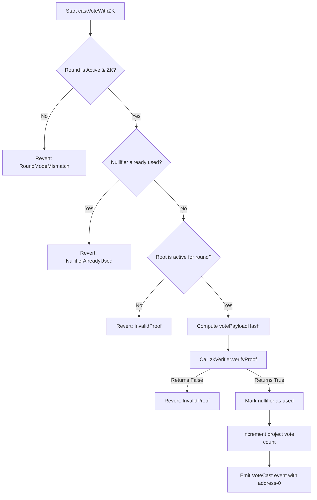

# Cryptographic Proposal: Transitioning to ZK-Nullifiers in Pharmacy Fiduciary Commons

This dossier outlines the proposed cryptographic architecture to transition voter registration and rebate claims from **stable public credential hashes** to **scoped nullifiers** within the Pharmacy Fiduciary Commons. This transition is designed to prevent linkage attacks and protect independent pharmacies from corporate profiling and network retaliation.

---

## 1. Background & Current Leakage Surfaces

### A. Vulnerable Code Segments
In the current implementation of `PatientFundParticipatoryBudgeting.sol`, participant privacy is compromised by two major linkage vectors:

1. **Voter-to-Wallet Linkage**: 
   The registration functions—`registerVoter` (L303), `registerVotersBatch` (L313), `registerVoterWithSignature` (L329), and `registerVoterWithCredential` (L382)—all store the voter's public wallet address directly in the `registeredVoters` mapping:
   ```solidity
   registeredVoters[roundId][voter] = status;
   ```
   When voting, `castVote` (L548) checks this mapping against `msg.sender` and sets:
   ```solidity
   hasVoted[roundId][msg.sender][projectId] = true;
   ```
   This is accompanied by public events that reveal the voting address:
   ```solidity
   emit VoteCast(roundId, projectId, msg.sender);
   ```

2. **Stable Hash Exposure**:
   In `registerVoterWithSignature` and `registerVoterWithCredential`, the voter presents a `credentialHash` which is derived off-chain from their stable physical identity (NCPDP/NPI). This stable hash is stored and published through `RegistrationAuthorizationUsed`:
   ```solidity
   emit RegistrationAuthorizationUsed(roundId, voter, credentialHash, policyVersion, deadline);
   ```
   Because this hash is stable across rounds and epochs, any observer can track the active wallet address of a specific pharmacy across multiple rounds, completely defeating on-chain anonymity.

3. **Mock ZK Verification Limitations**:
   Although `registerVoterWithMockZK` (L428) is introduced as a semantic mock milestone, it still sets `registeredVoters[roundId][msg.sender] = true` and verifies the proof using the caller's address in `_isValidMockZKProof` (L446):
   ```solidity
   bytes32 expectedProofHash = keccak256(
       abi.encode(
           MOCK_ZK_REGISTRATION_TYPEHASH,
           roundId,
           voter, // msg.sender
           nullifier,
           MOCK_ZK_VERIFIER_VERSION,
           roundMockZKRoots[roundId]
       )
   );
   ```
   This retains linkability because the voter's address must be registered, and they must pay gas or submit from their personal wallet to cast a vote, linking their blockchain address to the nullifier.

### B. Profiling and Retaliation Risk
As highlighted in `IDENTITY_NULLIFIER_DESIGN.md` Section 5, PBMs and insurance carriers can monitor the public blockchain. If they link a pharmacy's public wallet address or stable credential hash to their real-world identity once:
- They can reconstruct the pharmacy's entire history of claims, disputes, and votes.
- They can correlate participation in matching pools, leading to targeted contract terminations or rate reductions.
- Historical data becomes retroactively de-anonymizable if any single transaction is ever linked.

---

## 2. Proposed Cryptographic Nullifier Design

To achieve true unlinkability, we must replace the stable `credentialHash` with a scoped nullifier system and decouple wallet addresses from the voting and claiming actions.

### A. Primitive Selection: Poseidon Hash
We propose using the **Poseidon hash function** as our core SNARK-friendly primitive. Poseidon is optimized for arithmetic circuits, offering significantly lower constraint counts in R1CS compared to SHA-256 or Keccak-256.

### B. Credential Commitments & Membership Tree
1. **Credential Secret ($S$)**: Each participant generates a local cryptographically secure random value $S \in \mathbb{F}_p$ (using the BN254/BabyJubjub scalar field). This secret is never shared.
2. **Commitment ($C$)**: The credential commitment is computed as:
   $$C = \text{Poseidon}(S)$$
3. **Merkle Membership Tree**: Eligible commitments $C_i$ are placed in an off-chain Merkle tree of fixed depth $d = 20$.
   - The tree root $R$ is published on-chain by trusted issuers or governance.
   - To participate, a user proves they know a secret $S$ such that $\text{Poseidon}(S)$ resides in the Merkle tree with root $R$.

### C. Scoped Nullifier Derivation & Domain Separation
To prevent cross-workflow correlation, nullifiers must be unique to their specific workflow domains. We define the general nullifier derivation function as:
$$\eta = \text{Poseidon}(S, \text{Scope ID}, \text{Domain Prefix})$$

We define six domain prefixes as 256-bit constant values (derived from the hash of the domain name):

| Workflow | Domain Prefix String | Domain Prefix Value | Scope ID | Unlinkability Effect |
| :--- | :--- | :--- | :--- | :--- |
| **Round Voting** | `"round_voting"` | `keccak256("round_voting")` | `roundId` | Prevents double-voting in a round; votes in round $N$ cannot be linked to round $N+1$. |
| **Epoch Claim** | `"epoch_claim"` | `keccak256("epoch_claim")` | `epochId` | Prevents double-claiming in a distribution epoch; claims cannot be linked to voting records. |
| **Dispute Filing** | `"dispute"` | `keccak256("dispute")` | `disputeId` | Submits anonymous disputes; cannot be correlated with claims or voting. |
| **Portability Export** | `"portability_export"` | `keccak256("portability_export")` | `exportId` | Exports credential history without exposing identity. |
| **Migration** | `"migration"` | `keccak256("migration")` | `migrationId` | Proves continuity from v1 to v2 without linking v1 activity. |
| **Emergency Revocation** | `"emergency_burn_revocation"`| `keccak256("emergency_burn_revocation")`| `burnId` | Invalides credential in ZK accumulator without exposing participant. |

### D. The Vote Correlation Problem: Round-Scoped vs. Project-Scoped Nullifiers
If a voter casts multiple votes in a round (e.g., voting for project A and project B) and uses a single round-scoped nullifier $\eta_{round}$, all their votes in that round can be correlated by an observer:
- "Voter with nullifier $0x9ab8...$ voted for Project A and Project B."

To achieve complete unlinkability of voting choices *within* a round, we must derive a **Project-Scoped Nullifier**:
$$\eta_{round, project} = \text{Poseidon}(S, \text{Round ID}, \text{Project ID}, \text{Domain Prefix})$$
- **Pros**: Complete choice privacy; an observer cannot link whether the same voter voted for both projects.
- **Cons**: Increases the on-chain nullifier tracking storage. If a voter can vote on 50 projects, we track up to 50 nullifiers per voter.

---

## 3. Solidity Interface Changes

To implement this architecture on-chain, we must deprecate the current wallet-linked registration and voting methods and introduce a decoupled, verifier-mediated structure.

### A. Interface of the ZK Verifier
We introduce the `IZKVerifier` interface:
```solidity
// SPDX-License-Identifier: MIT
pragma solidity 0.8.20;

interface IZKVerifier {
    /**
     * @notice Verifies a groth16 zero-knowledge proof.
     * @param proof The serialized proof bytes (A, B, C components).
     * @param publicInputs The public inputs array: [nullifier, root, scopeId, domainPrefix, votePayloadHash].
     * @return isValid True if the proof is mathematically valid.
     */
    function verifyProof(
        bytes calldata proof,
        uint256[5] calldata publicInputs
    ) external view returns (bool isValid);

    function verifierVersion() external view returns (bytes32);
}
```

### B. Proposed Contract State and Mappings
In `PatientFundParticipatoryBudgeting.sol`, we deprecate:
- `registeredVoters` mapping (which linked addresses).
- `hasVoted` mapping (which linked addresses to projects).

We introduce:
```solidity
    // Active ZK Verifier contract address
    address public zkVerifier;
    
    // Verifier version registered by governance
    bytes32 public zkVerifierVersion;

    // roundId -> active Merkle roots accepted for verification
    mapping(uint256 => mapping(bytes32 => bool)) public activeRoundRoots;

    // roundId -> nullifier -> used status
    mapping(uint256 => mapping(bytes32 => bool)) public roundNullifiersUsed;

    // Optional: if using project-scoped nullifiers to prevent linkage of voter choices within a round
    // roundId -> project-scoped-nullifier -> used status
    mapping(uint256 => mapping(bytes32 => bool)) public projectNullifiersUsed;
```

### C. New Solidity Functions

#### 1. Direct ZK-Voting via Relayer
This function replaces the two-step registration-then-voting workflow. It executes the vote directly using the ZK-proof, allowing relayers to submit the transaction to hide the voter's gas address.
```solidity
    /**
     * @notice Casts a vote in ZK mode, verifying a membership proof and nullifier.
     * @param roundId The ID of the active budgeting round.
     * @param projectId The ID of the project being voted for.
     * @param root The published membership Merkle root.
     * @param nullifier The scoped nullifier: Poseidon(S, roundId, domainPrefix).
     * @param proof The ZK-proof bytes (Groth16 proof parameters).
     */
    function castVoteWithZK(
        uint256 roundId,
        uint256 projectId,
        bytes32 root,
        bytes32 nullifier,
        bytes calldata proof
    ) external nonReentrant whenNotPaused {
        Round storage r = rounds[roundId];
        if (r.state != RoundState.Active) revert NotActive();
        if (!r.isZKMode) revert RoundModeMismatch();
        if (projectId >= r.projectCount) revert ProjectInactive();
        if (nullifier == bytes32(0)) revert InvalidAuthorizationMetadata();
        
        // 1. Validate the Merkle root is active for this round
        if (!activeRoundRoots[roundId][root]) revert InvalidProof();

        // 2. Prevent double voting in this round
        if (roundNullifiersUsed[roundId][nullifier]) revert NullifierAlreadyUsed();

        // 3. Construct public inputs for the ZK Verifier
        // We bind the proof to the specific vote details (roundId, projectId) to prevent replay/hijacking.
        bytes32 votePayloadHash = keccak256(abi.encodePacked(roundId, projectId, address(this), block.chainid));
        
        uint256[5] memory publicInputs = [
            uint256(nullifier),
            uint256(root),
            roundId,
            uint256(keccak256("round_voting")),
            uint256(votePayloadHash)
        ];

        // 4. Verify ZK Proof via the registered verifier contract
        if (!IZKVerifier(zkVerifier).verifyProof(proof, publicInputs)) {
            revert InvalidProof();
        }

        // 5. Mark nullifier as consumed
        roundNullifiersUsed[roundId][nullifier] = true;

        // 6. Record vote
        Project storage p = roundProjects[roundId][projectId];
        p.voteCount += 1;

        emit VoteCast(roundId, projectId, address(0)); // Emit address(0) to prevent wallet linkage
        emit MockZKRegistrationUsed(roundId, nullifier); // Retained for compatibility
    }
```

---

## 4. On-Chain Verification Pipeline Steps

To ensure cryptographic integrity and prevent front-running, double-spending, and replay attacks, the Solidity contract must execute the following verification steps:



1. **Active and Mode Verification**: Confirm that the target round is active (`r.state == RoundState.Active`) and has ZK mode enabled (`r.isZKMode == true`).
2. **Double-Spending Prevention**: Check `roundNullifiersUsed[roundId][nullifier]` to verify that this participant has not voted in this round yet.
3. **Root Authenticity Check**: Confirm `activeRoundRoots[roundId][root] == true` to ensure the prover used a membership root that was explicitly authorized by the contract council.
4. **Replay and Hijacking Protection (`votePayloadHash`)**:
   - Construct `votePayloadHash = keccak256(abi.encodePacked(roundId, projectId, contractAddress, chainId))`.
   - Passing this hash as a public input guarantees that the proof was generated specifically for this contract instance, on this chain, for this round, and for this project. If an attacker intercepts the proof in the mempool, they cannot attach it to a different project or re-submit it to another chain.
5. **Verifier Delegation**: Call `verifyProof` on `zkVerifier`, passing the proof and the public inputs vector.
6. **State Mutators**: Upon successful verification, mark the nullifier as consumed, update the project vote tally, and emit an event. Note that the event does not record `msg.sender` to preserve transaction anonymity.

---

## 5. Resolving the "Decisions Required Before Circuits"

In reference to Section 4 of `ZK_NULLIFIER_TRANSITION_REQUIREMENTS.md`, we propose the following specific designs to resolve the outstanding architectural choices:

### 1. Participant Identity Unit
*   **Recommendation**: Bind eligibility to the **NPI/NCPDP Credential**.
*   **Rationale**: Binding to NPI/NCPDP matches real-world pharmacy licenses. A pharmacy can rotate their wallet addresses (e.g. for security or gas relayers) without losing their credential or exposing their business structure.

### 2. Secret Custody and Device Loss Model
*   **Recommendation**: Local browser storage of the secret seed $S$ encrypted with a user-defined password, combined with a **threshold multi-party or auditor recovery path**.
*   **Rationale**: If a pharmacy loses their device, they present their real-world credentials to an independent auditor offline. The auditor verifies their identity and issues a new credential commitment $C_{new} = \text{Poseidon}(S_{new})$ which is added to the next Merkle root, while the old commitment $C_{old}$ is marked as revoked.

### 3. Anonymity Set Target
*   **Recommendation**: Enforce a minimum threshold of $M = 20$ participants in a round or region before activation.
*   **Rationale**: If the set of participants is too small, an observer can easily correlate claims and votes to individual businesses based on timing or amounts.

### 4. Nullifier Domain Separation
*   **Recommendation**: Enforce standard string constants hashed into $256$-bit values as the prefix in the Poseidon hash (as defined in Section 2.C above).

### 5. Membership Tree Schema
*   **Recommendation**: Merkle tree of depth 20 using Poseidon.
*   **Rationale**: Fits up to $2^{20} \approx 1,000,000$ leaves, which easily covers all licensed pharmacies in the country. The root is updated on-chain by the council or authorized issuers.

### 6. Issuer Trust and Proof Model
*   **Recommendation**: A hybrid model where the on-chain contract stores approved Merkle roots, and the off-chain issuer generates signed membership credentials that are validated when building the tree.
*   **Rationale**: Minimizes on-chain computational cost while maintaining auditable paths of inclusion.

### 7. Non-Revocation Model
*   **Recommendation**: Short-lived credentials (e.g., weekly or monthly epochs) combined with a council-controlled **revocation tree/accumulator**.
*   **Rationale**: In ZK mode, to revoke a voter, the voter must prove they do not belong to the revoked tree (non-membership proof). Short-lived credentials naturally expire, reducing the size of the active revocation list.

### 8. Wallet/Address Privacy Strategy
*   **Recommendation**: Complete decoupling of the wallet. Introduce a **gas relayer (such as Open GSN or an ERC-4337 bundler)**.
*   **Rationale**: The voter’s wallet is never checked on-chain during ZK voting. The relayer pays gas and submits the transaction, preventing on-chain analysis of the gas source.

### 9. Event Schema
*   **Recommendation**: Replace `VoteCast(roundId, projectId, voter)` with:
    ```solidity
    event VoteCastPrivate(uint256 indexed roundId, uint256 indexed projectId, bytes32 indexed nullifier);
    ```
*   **Rationale**: Omits the address, leaving only the nullifier to verify that the vote was counted once without exposing who cast it.

### 10. Legacy Migration Boundary
*   **Recommendation**: Freeze and deprecate all legacy rounds (Rounds 1 to $N$). Label them on the dashboard as "Unshielded / Prototype Mode".
*   **Rationale**: Ensures no participants mistakenly assume their historic activities are protected by the new ZK layer.

### 11. Verifier and Circuit Governance
*   **Recommendation**: Council role handles verifier address rotation (`setZKVerifier`) via a multi-signature wallet with a 7-day timelock.
*   **Rationale**: Protects the system against malicious verifier upgrades while allowing upgradeability for new proof architectures.

### 12. Proving Key and Witness Handling
*   **Recommendation**: Client-side witness and proof generation using `snarkjs` in the browser.
*   **Rationale**: Prevents relayer or server-side logging of credential secrets. All secret keys and intermediate values are discarded immediately after the proof is compiled.

### 13. Redaction Rules for Dashboard/CLI
*   **Recommendation**: Scrub browser local storage, CLI history, and support logs. The registration/vote JSON payloads shown to users must only contain public parameters (`nullifier`, `root`, `proof`). Raw credentials or witness inputs must never be printable.

### 14. Care-Continuity Fallback
*   **Recommendation**: Establish an off-chain emergency fund and support network.
*   **Rationale**: If a pharmacy is identified and retaliated against, the fiduciary commons must have a legal and financial safety net ready to assist.
