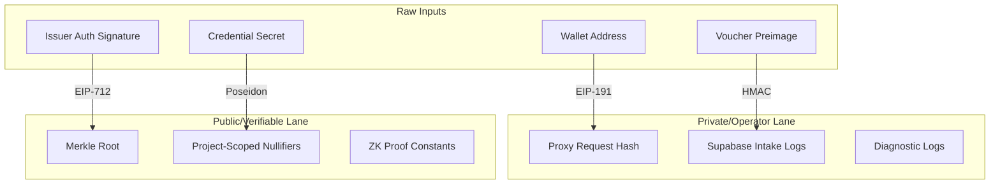

# Claim, Credential, and Proof Lineage Flow Specification

This document defines the formal claims, definitions, design invariants, and data lineage lanes for the ZK-Nullifier system in the Pharmacy Fiduciary Commons. It applies the "Claims Layer" discipline to separate current fixture-gated evidence from future production privacy requirements.

---

## 1. Mathematical Definitions & Design Invariants

### Definition 1: Project-Scoped Nullifier
For a voter holding a secret key $s$ (representing their unique, verified credential), the project-scoped nullifier $\eta$ in a participatory budgeting round $R$ for project $P$ is derived as:
$$\eta = \text{Poseidon}(s, R, P, \Delta)$$
Where:
- $s \in \mathbb{F}_p$ is the voter's high-entropy secret key.
- $R \in \mathbb{F}_p$ is the round ID.
- $P \in \mathbb{F}_p$ is the project ID.
- $\Delta \in \mathbb{F}_p$ is the domain separator identifying the deployment.

### Design Invariant 1: Double-Vote Prevention (Uniqueness Spec)
*(Note: Spec-only design requirement for production circuits. Current contract contracts use mock verifier fixture gates.)*
For any fixed round ID $R$ and project ID $P$, a voter using secret $s$ can only generate a single valid nullifier $\eta$. 
- **Spec Invariant**: Since $\text{Poseidon}$ is a deterministic hash function, the input tuple $(s, R, P, \Delta)$ mapped to $\eta$ is unique. The target smart contract pattern blocks double voting by checking and writing to the state map:
  $$\text{used}[R][P][\eta] = \text{true}$$
  Any subsequent attempt to submit a vote with the same $\eta$ for the same $(R, P)$ will revert.

### Design Invariant 2: Cryptographic Nullifier Unlinkability (Spec-Only Privacy Bound)
*(Note: Spec-only fixture-gated model. Full unlinkability requires production Circom prover tooling and ZK relay infrastructure.)*
Given two public nullifiers $\eta_1$ and $\eta_2$ generated in round $R$:
$$\eta_1 = \text{Poseidon}(s_1, R, P_1, \Delta)$$
$$\eta_2 = \text{Poseidon}(s_2, R, P_2, \Delta)$$
- **Narrow Spec Invariant**: If $P_1 \neq P_2$, then an observer holding no knowledge of secrets $s_1, s_2$ cannot determine whether $\eta_1$ and $\eta_2$ were generated by the same secret ($s_1 = s_2$) based purely on the nullifier byte values.
- **Design Assumption**: The $\text{Poseidon}$ hash function acts as a cryptographically secure Pseudo-Random Function (PRF) over $\mathbb{F}_p$. Nullifier values $\eta_1$ and $\eta_2$ are computationally indistinguishable from independent random field elements.
- **Explicit Non-Claim (Metadata Correlation Risk)**: This invariant applies strictly to the static nullifier bytes $\eta$. It does **NOT** prevent correlation derived from:
  - On-chain transaction timing or block-inclusion clustering.
  - Public wallet addresses used to submit ZK proof transactions (gas-payer linkage).
  - Single-relayer batching of multiple vote nullifiers in a single RPC submission.
  - Client-side IP/Session network metadata exposed to centralized relayers.
- **Mitigation Requirement**: Complete end-to-end voting privacy requires combining Design Invariant 2 with gasless meta-transaction relay networks and randomized batch dispatch timers.

---

## 2. Claim / Credential / Proof Lineage Flow

To ensure lineage does not become a tool for surveillance, the production design specifies a strict physical and logical boundary between three distinct data lanes:

### Lane A: Private / Operator Lineage (Transient & Redacted)
Used strictly by the database proxy operator for transaction routing, diagnostics, and recovery sagas:
- Full request hashes (`request_hash` in ledger).
- Registration ledger status (`pending`, `completed`, `failed`).
- Transient relayer metadata & diagnostic logs.

### Lane B: Public / Verifiable Lineage (On-Chain & Audit Ledger)
The minimal, zero-knowledge audit trail exposed to the public blockchain or community juries:
- Merkle membership roots.
- Project-scoped nullifiers ($\eta$).
- ZK proof constraints ($[\pi_A, \pi_B, \pi_C]$).
- Round IDs, project IDs, and policy version bytes (`bytes32`).

### Lane C: Never Public (Strict Leakage Boundary)
Data that must never cross the client boundary or be stored by the operator:
- **Wallet-to-Credential Mapping**: Public addresses are never linked to credential secrets $s$ or stable credential hashes.
- **Voucher Preimages**: Plaintext voucher codes are blinded at the client via HMAC prior to transmission.
- **IP/Session Metadata**: Stripped by origin filters and rate limiters.

---

## 3. Swarm Consensus Adversarial Design Review

To stress-test this specification, we run a mock **Expert Swarm Analysis** consisting of three biased experts and a devil's advocate, merged at low temperature.

### Expert 1: Privacy & Anti-Surveillance Architect
- **Verdict**: *Conditional Approval*
- **Focus**: Eliminating metadata linkage vectors.
- **Main Arguments**:
  1. The project-scoped Poseidon nullifier successfully prevents tracking a voter's choices across projects.
  2. Separating private operator logs from the public audit ledger is a critical defense-in-depth step.
- **Risk Identified**: If the client uses the same wallet to pay gas for submitting ZK proofs to different projects, the public gas-payer address completely links their votes, bypassing the ZK nullifier's privacy.
- **Condition**: Votes must be submitted via a decentralized relayer network (e.g. gasless meta-transactions) so the voter's public wallet never touches the gas fee.

### Expert 2: Smart Contract Security Engineer
- **Verdict**: *Approved*
- **Focus**: Double-voting prevention and gas bounds.
- **Main Arguments**:
  1. Storing `used[roundId][projectId][nullifier]` is simple and prevents double voting.
  2. The verifier contract interface is stateless, keeping gas consumption constant regardless of voter registration size.
- **Risk Identified**: If a project ID is deleted or modified mid-round, nullifiers could be re-used or lockouts could occur.
- **Condition**: Round project registries must be frozen and immutable once a round starts.

### Expert 3: UX & Key Management Designer
- **Verdict**: *Against*
- **Focus**: User friction and key recovery.
- **Main Arguments**:
  1. If the voter secret $s$ is generated in the browser, how is it backed up? If they clear cookies/local storage, they lose their voting identity permanently.
  2. Pasteboard json copying is high-friction for mobile users.
- **Risk Identified**: Users will store their raw secret $s$ in plaintext notes files, creating a leakage vector.
- **Condition**: Implement an encrypted local storage key-vault or derive $s$ deterministically from an EIP-191 signature of a fixed string (e.g. `personal_sign` of `"Fiduciary Commons Identity Secret"`).

### Devil's Advocate (Consensus Attacker)
- **Shared Blind Spot**: The experts assume the `Poseidon` hash function is secure, but Poseidon has a small field size and is vulnerable to front-running if the input inputs are observable.
- **Fatally Wrong Scenario**: If the voter secret derivation uses the wallet address as a seed, the unlinkability invariant is broken because the secret space is public.
- **Avoided Question**: If the database proxy operator colludes with the on-chain relayer, does the entire privacy model collapse? Yes, because the relayer knows which IP address sent which proof.

---

## 4. Reconciled Swarm Verdict (Merge)

1. **Agreement**: The project-scoped nullifier formula $\eta = \text{Poseidon}(s, R, P, \Delta)$ mathematically prevents cross-project linkage, provided $s$ remains private.
2. **Conflict**: Strong tension between UX key recovery (desiring deterministic derivation from wallet signature) and Privacy (desiring complete unlinkability from public wallets).
   - *Resolution*: Derive the secret $s$ client-side via a standard EIP-191 signature of a static message. This provides recovery without exposing the wallet address directly in the nullifier output.
3. **Actionable Backlog Requirements**:
   - Update frontend to derive secret $s$ via `personal_sign` of a static string.
   - Enforce relayer gas-funding to prevent wallet linkage via gas-payer history.
   - freeze project list immutability on-chain per round.
